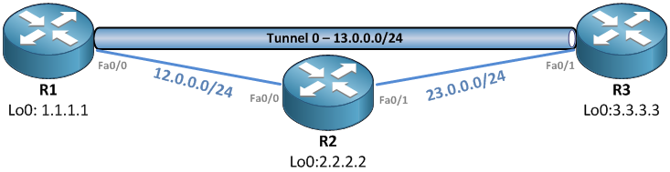

# GRE Tunnels

## Configuring GRE

GRE tunnels appear as directly connected logical interfaces to the router even though the traffic that goes into the tunnel will actually be carried over other physical interfaces to the destination. To configure a GRE tunnel you have to set the source and the destination of the tunnel on each end. The source can be an interface or the IPv4 or IPv6 address of an interface. The tunnel destination can only be an IPv4 or IPv6 address on the other router.

```
R(config)# interface TUNNEL-INTERFACE-ID
R(config-if)# tunnel mode gre {ip|ipv6|multipoint}
R(config-if)# tunnel source {INTERFACE|IPV4-ADDRESS|IPV6-ADDRESS/MASKLEN}
R(config-if)# tunnel destination{IPV4-ADDRESS|IPV6-ADDRESS}
```

As you can see, the tunnel can run over IPv4 or IPv6 depending on the tunnel mode. By default a tunnel interface is set to **gre ip**. The multipoint option will be discussed in another article.\
GRE tunnels can also transport IPv4 and IPv6, depending on the Layer 3 addresses that are configured on the tunnel interface:

```
R(config-if)# ip address {IPV4_ADDRESS MASK| IPV6_ADDRESS/MASKLEN}
```

A tunnel interface will come up on one router regardless of the end-to-end connectivity. To have a more reliable status of the interface we should enable keepalives, which are disabled by default. The keepalive mechanism is pretty ingenious and can be enabled on only one side, or with different options on both sides. Read [this article](https://www.cisco.com/en/US/tech/tk827/tk369/technologies\_tech\_note09186a008040a17c.shtml) for more details.

```
R(config-if)# keepalive [PERIOD [RETRIES]]
```

A limited security mechanism can be implemented, in which the routers must attach a preshared numerical key to each packet. If the keys don’t match, the destination will drop the packets.

```
R(config-if)# tunnel key KEY-VALUE
```

Normally, when bringing up a tunnel between 2 routers we create a loop because there are now 2 logical paths for the traffic: One over the physical links and one over the logical tunnel interface. One thing that is very probable to happen is to have a “**recursive routing**” loop. This will happen if the routing mechanism decides to use the logical tunnel interface to reach the defined tunnel destination. Cisco IOS detects this and will move the tunnel interface to a down state. This will probably disable the route through the tunnel interface which will re-enable the Tunnel interface and then the route through the interface will come up and IOS will again detect the “recursive routing” situation, and so on.

## The example



Each router will be configured with a loopback address. We will create a tunnel between R1 and R3 and we will use EIGRP for route distribution.\
Here’s the starting configs that only include IP addressing information

```
! On R1:
interface Loopback0
 ip address 1.1.1.1 255.255.255.255
!
interface FastEthernet0/0
 ip address 12.0.0.1 255.255.255.0
 duplex auto
 speed auto
!
router eigrp 100
 network 0.0.0.0
 no auto-summary
! On R2
interface Loopback0
 ip address 2.2.2.2 255.255.255.255
!
interface FastEthernet0/0
 ip address 12.0.0.2 255.255.255.0
 duplex auto
 speed auto
!
interface FastEthernet0/1
 ip address 23.0.0.2 255.255.255.0
 duplex auto
 speed auto
!
router eigrp 100
 network 0.0.0.0
 no auto-summary
! On R3:
interface Loopback0
 ip address 3.3.3.3 255.255.255.255
!
interface FastEthernet0/1
 ip address 23.0.0.3 255.255.255.0
 duplex auto
 speed auto
!
router eigrp 100
 network 0.0.0.0
 no auto-summary
```

Now let’s create the tunnel interfaces on both ends:

```
!On R1:
R1(config)# interface Tunnel0
R1(config-if)# tunnel source 12.0.0.1
R1(config-if)# tunnel destination 23.0.0.3
R1(config-if)# ip address 13.0.0.1 255.255.255.0
!On R3:
R3(config)# interface Tunnel0
R3(config-if)# tunnel source 23.0.0.3
R3(config-if)# tunnel destination 12.0.0.1
R3(config-if)# ip address 13.0.0.3 255.255.255.0
```

Let’s test connectivity:

```
! On R1
R1#ping 13.0.0.3

Type escape sequence to abort.
Sending 5, 100-byte ICMP Echos to 13.0.0.3, timeout is 2 seconds:
!!!!!
Success rate is 100 percent (5/5), round-trip min/avg/max = 40/56/84 ms
```

OK – the tunnel seems to work – Let’s see how a traceroute looks:

```
R1#traceroute 13.0.0.3 numeric

Type escape sequence to abort.
Tracing the route to 13.0.0.3

  1 13.0.0.3 72 msec *  40 msec
```

As expected, R2 does not show up in the traceroute because the tunnel looks like a directly connected interface. Let’s see how can we reach R3’s loopback:

```
R1#tracer 3.3.3.3 numeric

Type escape sequence to abort.
Tracing the route to 3.3.3.3

  1 12.0.0.2 40 msec 28 msec 20 msec
  2 23.0.0.3 60 msec *  60 msec
```

Hmm, it seams we can actually see R2 in the trace. How come? Let’s look at the routing table:

```
R1#sh ip route
Gateway of last resort is not set

     1.0.0.0/32 is subnetted, 1 subnets
C       1.1.1.1 is directly connected, Loopback0
     2.0.0.0/32 is subnetted, 1 subnets
D       2.2.2.2 [90/409600] via 12.0.0.2, 00:13:14, FastEthernet0/0
     3.0.0.0/32 is subnetted, 1 subnets
D       3.3.3.3 [90/435200] via 12.0.0.2, 00:13:14, FastEthernet0/0
     23.0.0.0/24 is subnetted, 1 subnets
D       23.0.0.0 [90/307200] via 12.0.0.2, 00:13:14, FastEthernet0/0
     12.0.0.0/24 is subnetted, 1 subnets
C       12.0.0.0 is directly connected, FastEthernet0/0
     13.0.0.0/24 is subnetted, 1 subnets
C       13.0.0.0 is directly connected, Tunnel0
```

We see that in order to reach 3.3.3.3 we are using the link to R2, not through R3. Here’s why:

```
R1#sh ip eigrp topology
IP-EIGRP Topology Table for AS(100)/ID(1.1.1.1)

Codes: P - Passive, A - Active, U - Update, Q - Query, R - Reply,
       r - reply Status, s - sia Status

P 3.3.3.3/32, 1 successors, FD is 435200
        via 12.0.0.2 (435200/409600), FastEthernet0/0
        via 13.0.0.3 (297372416/128256), Tunnel0
! Rest of the output omitted
```

According to the EIGRP topology table, we have 2 routes towards 3.3.3.3, one over Fa0/0 through R2, and one over the Tunnel0 interface, through R3, but the metric via the Tunnel0 interface is a lot worse than via Fa0/0 and here’s the explanation:

```
R1#sh int fa0/0 | i BW
  MTU 1500 bytes, BW 10000 Kbit, DLY 1000 usec,
R1#sh int tun0 | i BW
  MTU 1514 bytes, BW 9 Kbit, DLY 500000 usec,
```

The default values for bandwidth and delay on a tunnel interface are much worse than on the physical interface. Let’s change this values to see if we can force the use of the other link:

```
R1(config-if)#delay 100
R1(config-if)#bandwidth 10000
```

Now, it won’t take much until we see these errors:

```
*Mar 1 08:12:36.197: %LINEPROTO-5-UPDOWN: Line protocol on Interface Tunnel0, changed state to up
*Mar 1 08:12:36.237: %DUAL-5-NBRCHANGE: IP-EIGRP(0) 100: Neighbor 13.0.0.3 (Tunnel0) is up: new adjacency
*Mar 1 08:12:45.197: %TUN-5-RECURDOWN: Tunnel0 temporarily disabled due to recursive routing
*Mar 1 08:12:46.197: %LINEPROTO-5-UPDOWN: Line protocol on Interface Tunnel0, changed state to down
*Mar 1 08:12:46.249: %DUAL-5-NBRCHANGE: IP-EIGRP(0) 100: Neighbor 13.0.0.3 (Tunnel0) is down: interface down
```

We have hit the Recursive Routing scenario, in which the router uses the Tunnel interface to reach the Tunnel destination. This is, of course an illegal operation. The Tunnel interface will change state do down. When the routes over the Tunnel interface expire, the router will try to bring up the tunnel interface. The tunnel will come up, a new EIGRP adjacency will form over the Tunnel interface, it will have a better path towards the Tunnel destination and we entered the loop. So, remember that the low bandwidth and high delay values on the Tunnel interface are just a protection mechanism against those kind of loops. OSPF also uses the bandwidth in the default cost formula so we should be safe most of the time (but not always!), but what about RIP? RIP will definitely cause some problems since the default metric only uses hop count, and we will have just one hop between the 2 ends of a tunnel.\
So how can we send traffic over the tunnel interface? One option is to use static routes to force the traffic over the Tunnel interface, but using static routes is not a good idea in large environments. Another option is to Policy Route traffic towards 3.3.3.3 via 13.0.0.3 but is just as unscalable as the static route and it is also more difficult to read out in the config.\
A third option is to use another routing protocol with a lower Administrative Distance than the one running over the Tunnel interface, to reach the tunnel destination.\
Probably the best option is to limit the routes advertised or received over the Tunnel interface, so that we don’t use the Tunnel interface to reach the Tunnel destination. To do this, we should use a distribute-list:

```
R1(config)# ip prefix-list LIST0 deny 12.0.0.0/24
R1(config)# ip prefix-list LIST0 deny 23.0.0.0/24
R1(config)# ip prefix-list LIST0 permit 0.0.0.0/0 le 32
R1(config)# router eigrp 100
R1(config-router)# distribute-list prefix LIST0 in Tun0
R1(config-router)# distribute-list prefix LIST0 out Tun0
```

I filtered on R1 both incoming and outgoing routes over Tunnel0 interface. Another method would have been to filter one way on each router, but the result is the same. Let’s see how that worked out:

```
R1#sh ip route
Gateway of last resort is not set

     1.0.0.0/32 is subnetted, 1 subnets
C       1.1.1.1 is directly connected, Loopback0
     2.0.0.0/32 is subnetted, 1 subnets
D       2.2.2.2 [90/409600] via 12.0.0.2, 00:10:11, FastEthernet0/0
     3.0.0.0/32 is subnetted, 1 subnets
D       3.3.3.3 [90/409600] via 13.0.0.3, 00:09:53, Tunnel0
     23.0.0.0/24 is subnetted, 1 subnets
D       23.0.0.0 [90/307200] via 12.0.0.2, 00:13:45, FastEthernet0/0
     12.0.0.0/24 is subnetted, 1 subnets
C       12.0.0.0 is directly connected, FastEthernet0/0
     13.0.0.0/24 is subnetted, 1 subnets
C       13.0.0.0 is directly connected, Tunnel0
R1#traceroute 3.3.3.3 source 1.1.1.1 numeric

Type escape sequence to abort.
Tracing the route to 3.3.3.3

  1 13.0.0.3 80 msec *  72 msec
```

It finally looks good.

## Conclusions on Recursive Routing

You saw that EIGRP prevents recursive routing situations in small scenarios like this one by using a default metric that is worse through the tunnel than through the physical path. The same happens with OSPF as long as the physical path has a bandwidth higher than 9kbps (default for GRE tunnels). However with RIP, things won’t go as smoothly because it’s metric is based on hop count and the tunnel interface will always count as 1 hop, while the physical path will probably be more than that. So, pay attention when using RIP over GRE tunnels, as it will enter the recursive routing state by default.
