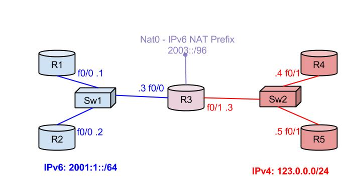

# Interconnecting IPv6 and IPv4

## Dual Stack

Dual Stack means running both IPv4 and IPv6 on the same interface. This doesn’t mean they are actually interconnected, just that they can both run at the same time on an interface.

## Tunnels

### Manual Tunnels

#### **IPv6 in IP Tunnels**

IPv6 can be encapsulated in IPv4 packets and transported across a virtual tunnel interface. To enable a tunnel that encapsulates IPv6 in IPv4, use:

```
R(config)# interface TUNNEL0
R(config-if)# tunnel mode ipv6ip
```

Also, a tunnel source and a destination must be set. These must be IPv4 addresses. For tunnel destination you can also configure an interface running IPv4.

```
R(config-if)#tunnel source {INTERFACE|SRC-IP-ADDR}
R(config-if)# tunnel destination DEST-IP-ADDR
```

#### **GRE Tunnels**

GRE Tunnels work the same, except the encapsulation protocol is GRE which works both with IPv4 and IPv6. The advantage with GRE is that it can encapsulate both IP and IPv6 and it can be transported with both IP and IPv6. GRE over IPv4 is the default encapsulation mode of Cisco Tunnels. You can set the tunnel mode to gre with:

```
R(config-if)# tunnel mode gre {ip|ipv6}
! gre ip: GRE over IPv4
! gre ipv6: GRE over IPv6
```

Also, a tunnel source and a destination must be set:

```
R(config-if)#tunnel source {INTERFACE|SRC-IP-ADDR}
R(config-if)# tunnel destination DEST-IP-ADDR
```

The transported protocol depends on the type of address that is set on the tunnel interface. It can be either an IPv4 address or an IPv6 address,

```
R(config-if)# ip address ..
R(config-if)# ipv6 address ..
```

### Automatic Tunnels

Automatic tunnels are inherently multipoint because the destination of the tunnel is dynamic, computed out of the IPv6 destination address of each packet. When an IPv6 packet is routed out the auto-tunnel interface, the router looks at the destination IPv6 which has to follow a certain rule based on the type of the auto tunnel. From the destination IPv6 address, it computes the IPv4 tunnel destination address. Now it know wheat is the tunnel destination for this particular packet. The process is performed again for each packet.\
Things happen the same on the return path, as well.\
You also have to make sure the routing table points IPv6 traffic destined for the tunnel on the correct tunnel interface.

The automatic tunnels are all based on ipv6ip encapsulation, so the configuration is similar:

```
R(config-if)# tunnel mode ipv6ip {6-to-4|auto-tunnel|isatap}
```

#### **6to4 Tunnels**

IANA Reserved the 2002::/16 prefix for 6to4 tunnels. The prefix of the address used should be in the format **2002:HAHB:HCHD::** where HA, HB, HC and HD are the hex values of A, B, C and D in the IPv4 address of the tunnel source: A.B.C.D.

To define the 6to4 automatic tunnel mode, use:

```
R(config)# tunnel TUNNEL0
R(config-if)# tunnel mode ipv6ip 6to4
```

Then, set a tunnel source but do not set a tunnel destination.

```
R(config-if)# tunnel source {INTERFACE|SRC-IP-ADDRESS}
! IPv4 source address is: A.B.C.D.
```

Then, set the IPv6 address of the tunnel interface.

```
R(config-if)# ipv6 address 2002:HAHB:HCHD::1/PREFIX-LEN
! Compute HA, HB, HC, HD based on the A.B.C.D address of the tunnel source
```

Next, a route to the peer(X.Y.Z.T) should be set. This must be done for each potential peer

```
R(config)# ipv6 route 2002:HXHY:HZHT::/PREFIX-LEN TUNNEL0
```

Automatic 6-to-4 tunnels can only be used for BGP peering, which uses unicast addresses. Other routing protocols use Link Local addresses and can’t work over an automatic 6-to-4 tunnel.

#### **Auto-Tunnels**

This feature is deprecated in real life scenarios, but it can be configured in IOS. This is also a point-to-multipoint configuration like 6-to-4 tunnels, so you don’t need to set a tunnel destination. You also don’t have to set an IPv6 address on the tunnel, as it was required in 6-to-4 tunnels.\
To configure auto-tunnels, just set the mode and the tunnel source:

```
R(config)# interface TUNNEL0
R(config-if)# tunnel mode ipv6ip auto-tunnel
R(config-if)# tunnel source {INTERFACE|SRC-IP-ADDRESS}
The auto-tunnel mode will automatically set an IPv6 Address on the tunnel interface, in the format ::HAHB:HCHD or ::A.B.C.D (these notations represent the same address).
Next, if you want to reach networks past the next hop router, a static routs or BGP can be used. A static route could look like:
R(config)# ipv6 route IPV6-PREFIX/PREFIX-LEN ::HXHY:HZHT
! or
R(config)# ipv6 route IPV6-PREFIX/PREFIX-LEN ::X.Y.Z.T					
```

#### ISATAP Tunnels

ISATAP(Intra-Site Automatic Tunnel Addressing Protocol) is also a point-to-multipoint configuration, like the other automatic tunnels. You don't need to setup a tunnel destination, but you need to set the IPv6 tunnel address using the ISATAP format. To configure it:

```
R(config)# interface TUNNEL0
R(config-if)# tunnel mode ipv6ip isatap
R(config-if)# tunnel source {INTERFACE|SRC-IP-ADDRESS}
R(config-if)# ipv6 address PREFIX/64 eui-64
! EUI-64 Interface ID will be in the format:0000:5EFE:HAHB:HCHD 
```

The router will automatically create an ISATAP specific eui-64 Interface ID in the following format: **0000:5EFE:HAHB:HCHD**, where A.B.C.D is the source of the tunnel. The IPv6 address of the tunnel, will therefor be **PREFIX::0000:5EFE:HAHB:HCHD/64** Next, if you want to reach networks past the next hop router, static routes or BGP can be used. A static route could look like:

```
R(config)# ipv6 route IPV6-PREFIX/PREFIX-LEN IPV6-TUN-PREFIX::5EFE:HXHY:HZHT
```

The advantage of using ISATAP is that it also has link-local addresses and therefor we should be able to run IGP protocol on such tunnels. Unfortunately the tunnels cannot use the multicast addresses so you will have to manually specify the neighbors. Another advantage is that the prefix is left to the administration's decision and is not fixed as in the other automatic tunnel modes.

## NAT-PT

NAT PT has been deprecated but Cisco IOS still supports it. It is similar to IPv4 NAT, but it can also translate the protocol from IPv4 to IPv6 and the other way around. To better understand the configuration, we will use this example:&#x20;



&#x20;NAT PT requires a few steps when configuring:

### Basic NAT PT config

Enable NAT PT on each interface and define the NAT PT Prefix:

```
R(config)# ipv6 unicast-routing
R(config)# interface IPV6-INTERFACE
R(config-if)# ipv6 nat
R(config-if)# exit
R(config)# interface IPV4-INTERFACE
R(config-if)# ipv6 nat
R(config-if# exit
```

Enabling NAT-PT will enable a virtual interface (NVI) on the router. For this interface we must define a prefix. This prefix must always be /96. (128-32)

```
R(config)# ipv6 nat prefix NAT-PT-PREFIX/96
```

The next to steps envolve defining a v6v4 and a v4v6 translation. Each translation can be configured using Static or Dynamic NAT. Dynamic NAT has the inconvenient that it can only be used on one side, and that side must initiate the Session. Static NAT however will be difficult to implement in many-to-many communications

### Define a v6v4 translation

The translation can be done using Static NAT or Dynamic NAT.

#### Static NAT

Translates the IPV6-SRC to an IPV4-ADDR on the IPv4 network or another subnet used only for NAT:

```
R(config)# ipv6 nat v6v4 source IPV6-SRC IPV4-ADDR
```

#### Dynamic NAT

Translates any IPv6 Address matched by an ACL or route-map into an IPv4-Address specified in a pool or used on an interface:

```
!using an interface:
R(config)# ipv6 nat v6v4 source {list ACL| route-map ROUTE-MAP} interface INT
! using a POOL
R(config)# ipv6 nat v6v4 source {list ACL| route-map ROUTE-MAP} pool V4-POOL
```

The V4-POOL must be defined using:

```
R(config)# ipv6 nat v6v4 pool V4-POOL IPv4-START IPv4-END prefix-length MASKLEN
```

#### Dynamic NAT with overload - PAT

PAT works the same as in IPv4 NAT. Instead of mapping each source to an IP address of the pool, the router will map multiple IPv6 addresses to the same IPv4 address, changing the L4 source Port in the translation.

```
R(config)# ipv6 nat v6v4 source {list ACL| route-map ROUTE-MAP} interface INT overload
! using a POOL
R(config)# ipv6 nat v6v4 source {list ACL| route-map ROUTE-MAP} pool V4-POOL overload
```

The V4-POOL must be defined using:

```
R(config)# ipv6 nat v6v4 pool V4-POOL IPv4-START IPv4-END prefix-length MASKLEN
```

### Define a v4v6 translation

The final step in making the communication work end-to-end is to define the translation for the traffic coming in the opposite direction. There are also a few options:

#### Static NAT

```
R(config)# ipv6 nat v4v6 source IPV4-SRC IPV6-ADDR
```

#### Dynamic NAT

```
R(config)# ipv6 nat v4v6 pool V6-POOL IPV6-START IPV6-END prefix-length MASKLEN
```

#### Automatic Mapping

You can configure the router to make automatic mappings between IPv4 and IPv6 addresses by adding the 32 bits of the IPv4 address to the 96 bits IPv6 NAT PT prefix and the other way around. To enable this feature, use:

```
R(config)# ipv6 nat prefix NAT-PT-PREFIX/96 v4-mapped ACL
! In our example:
R(config)# ipv6 nat prefix 2003::/96 v4-mapped ACL
```

The ACL is used to filter the traffic that will go through the NAT process.
