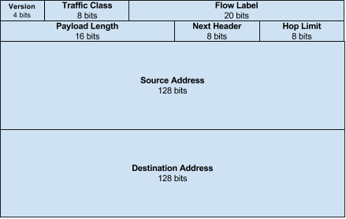
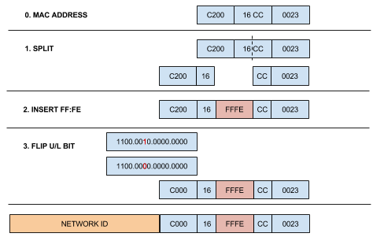

# IPv6-101

## IPv6 Packet Format

The IPv6 header has a fixed format (as opposed to the variable format of IPv4) of 40 Bytes



**Version** – 4 bits – always set to the value 6

* **Traffic Class** – 8 bits – 6 most significat bits are used for [DSCP](https://nyquist.eu/classification-and-marking/#222\_DSCP), 2 least significant bits are used as [ECN](https://nyquist.eu/congestion-avoidance-wred/#221\_WRED\_Explicit\_Congestion\_Notification\_ECN)
* **Flow Label** – 20 bits – Usage not completly standardized, but usually used to mark packets that should follow the same path in a multi-path environment.
* **Payload length** – 16 bits – size of the payload in Bytes, including any extension headers
* **Next Header** – 8 bits – Specifies the next header – either an extension header or the next layer (usually TCP) header
* **Hop Limit** – 8 bits – Similar to TTL
* **Source Address** – 128 bits
* **Destination Address** – 128 bits

## IPv6 Address Format

One of the features of IPv6 is the big address space. This is achieved by using addresses 128 bits long. IPv4 addresses were only 32 bits long.\
Such a big address number becomes difficult to represent in a human readable format, and the old convention used for IPv4 (dotted decimal: A.B.C.D) cannot be used anymore. The format that is used for IPv6 is of 8 groups of 16 bits, written in hex. An example could be:

```
2001:0DB8:0000:0000:0008:0000:0000:417A
```

To use an even shorter notations, 2 new rules are used:

1.  In any of the 8 groups, leading zeros can be omitted, but if they are all zeros, one stil has to show up. Our example becomes:

    ```
    2001:0DB8:0:0:8:0:0:417A
    ```
2.  Once, replace one or more groups of zeros with “::”. Our example becomes:

    ```
    2001:0DB8::8:0:0:417A
    !or 
    2001:0DB8:0:0:8::417A
    ```

### EUI64

EUI64 is a method of generating a unique Interface ID. [RFC 2464](https://tools.ietf.org/html/rfc2464) shows how to generate a unique Interface ID from the MAC Address of the interface.\
Split the MAC address in 2 equal parts, insert FF:FE in the middle to reach the required 64 bits and flip the U bit (Universal/Local bit, the 7th bit in the first Byte). It ends up subtracting (or adding) 2 from the second HEX digit of the MAC Address. If the interface doesn’t have a MAC address, a router may use a MAC addresses assigned to the router, the Serial Number, an md5 hash of the hostname or a random number to generate the EUI-64 address.\
Example



## IPv6 Address Types

IPv6 address usage has changed over the years and some types are now deprecated. A current address space and the address types can be seen at [IANA’s site](https://www.iana.org/assignments/ipv6-address-space/ipv6-address-space.xml). The current IETF RFC that deals with the Addressing Architecture is [RFC 4291](https://tools.ietf.org/html/rfc4291).

### Unicast

On an interface you can have multiple IPv6 addresses. There is no “secondary” address, all of them are “primary”. [RFC 3484](https://www.ietf.org/rfc/rfc3484.txt) describes what address should be used to source traffic.

You can set unicast address manually, using:

```
R(config-if)# ipv6 address IPV6-ADDRESS/PREFIX-LEN
! Using EUI-64:
R(config-if)# ipv6 address IPV6-PREFIX/PREFIX-LEN eui-64
! Using another interface IPv6 address
R(config-if)# ipv6 address unnumbered INTERFACE
```

Unicast addresses can also be dynamically assigned using DHCPv6 or autoconfig. Autoconfig will use eui-64 for the Interface ID and the prefix received in RA from the router:

```
R(config-if)# ipv6 address autoconfig [default]
! default - will also insert a default route in the routing table
```

#### **Global Unicast 2000::/3**

The format is

```
| 3 |        45 bits        |  16 bits  |    64 bits   |
+---+-----------------------+-----------+--------------+
|001| global routing prefix | subnet ID | Interface ID |
+---+-----------------------+-----------+--------------+
```

Address space: 2000:: –> 3FFF:…:FFFF.\
The interface ID can be represented in EUI-64 format based on the MAC address or it can be manually assigned.

#### **Link Local Unicast FE80::/10**

Link Local addresses are used on a single link (point-to-point or multi-access) and are used for autoconfiguration, neighbor discovery, and so on. They are not forwarded out of their scope. The format used for Link Local addresses is:

```
|  10 bits |   54 bits |       64 bits      |
+----------+-----------+--------------------+
|1111111010|   00..0   |    Interface ID    |
+----------+-----------+--------------------+
```

Address space: FE80:: –> FEBF:…:FFFF.\
By default, when an interface comes up, it automatically generates a link-local address using the FE80::/10 prefix and the EUI64 Interface ID. To override the automaticly generated link-local address, use:

```
R(config-if)# ipv6 address IPV6-ADDRESS link-local
```

Pinging a Link Local Unicast Address requires declaring what interface to use.

#### **IPv4 compatibile**

An IPv4 compatibile IPv6 address contains 96 bits of zero followed by 32 bits of the IPv4 address:

```
|  96 bits |      32 bits    |
+----------+-----------------+
|  00..0   |  IPv4 address   |
+----------+-----------------+
```

#### **Unique Local Address (ULA) FC00::/7**

Unique Local addresses are standardized by [RFC 4193](https://tools.ietf.org/html/rfc4193) and are intended for local use, not to be routed in the Internet. They are similar to IPv4 local addresses (10.0.0.0/8, 172.16.0.0/12 and 192.168.0.0/16). The format is:

```
| 7 bits|L|   40 bits   |  16 bits  |    64 bits   |
+-------+-+-------------+-----------+--------------+
|1111110|1|  Global ID  | subnet ID | Interface ID |
+-------+-+-------------+-----------+--------------+
```

Address space: FC00:: –> FD00:…FFFF. Since only addresses with the 8th bit set to 1 are permitted, this actually means the usable space is FD00::/8.

### Anycast

An anycast address is an address that is assigned to multiple interfaces. The difference between anycast and multicast is that while a packet sent to a multicast address will reach all interfaces in the multicast group, a packet sent to an anycast address will reach only the interface that is “closest” in terms of routing. This is useful in representing geographically different hosts with the same IP address.\
On a subnet, each router must be able to respond to the Anycast address with all-zeros in the host field. This is the Subnet-Router Anycast Address:

```
|      n bits        |      128-n bits      |
+--------------------+----------------------+
|    subnet prefix   |         00..0        |
+--------------------+----------------------+
```

Anycast addresses are set similar to a global unicast address, but the **anycast** keyword must be used:

```
R(config-if)# ipv6 address IPV6-ADDRESS/IPV6-PREFIX-LEN anycast
```

### Mutlicast FF00::/8

See [IPv6 Multicast](https://nyquist.eu/multicast-ipv6)

### Unspecified and Loopback Addresses

The unspecified address is an all-zeros address, also written as ::/128 and indicates no IPv6 address assigned on a specific interface.\
The loopback address is used by a host to send packets to itself. It has 127 zeros and one last bit of 1. It is written as ::1/128

## Neighbor Discovery

ND, defined in [RF2461](https://tools.ietf.org/html/rfc2461), is a process that uses ICMPv6 messages to replicate and ehance IPv4 ARP features. ND defines 5 ICMP packet types:

* **Router Solicitation – RS**: When an interface comes up, a RS is sent to request an RA from the router
* **Router Advertisement – RA**: Packets used by routers to advertise their presence. They are sent periodically or as a response to a Router Solicitation packet
* **Neighbor Solicitation – NS**: Sent by a node to determine the Link Layer address (MAC on Ethernet) of a neighbor. Also used for Duplicate Address Detection
* **Neighbor Advertisement – NA**: Sent in response to a NS. A node can also send unsolicited NA when its link-layer addres (MAC on Ethernet) changes
* **Redirect**: Used by routers to inform hosts of a better next-hop for a destination

These messages are used to offer the following features:

* **Router Discovery**: Hosts locate the routers on their link
* **Prefix Discovery**: Hosts discover their prefix on the link
* **Parameter Discovery**: Hosts discover other parameters, like MTU or TTL of outgoing packets
* **Address Auto configuration**: Hosts will autoconfigure an address based on the link-local prefix or the prefix advertised by the router and the EUI-64 Interface ID.
* **Address Resolution**: Finding a neighbor’s Layer 2 address (similar to IPv4 ARP)
* **Next-hop determination**
* **Neighbor Unreachability Detection**: NS and ND messages are sent in order to verify that a neighbor is reachable or not.
* **Duplicate Address Detection**
* **Redirect**

On a router interface you can tune ND parameters, using:

```
R(config-if)# ipv6 nd OPTIONS
```

To see IPv6 neighbors (from NA messages, similar to IPv5 ARP cache), use:

```
R# show ipv6 neighbors
```

To see IPv6 routers from (from RA messages), use:

```
R# show ipv6 routers
```

To see how Neighbor Discovery works you can enable debugging with:

```
R# debug ipv6 nd
```
