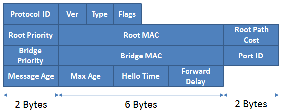
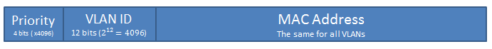

# 802.1d – STP

## BPDUs – Bridge Protocol Data Units

BPDUs are sent as 802.3 frames with the source address set to the MAC address of the sending switch port and with a destination address of **01:80:C2:00:00:00**. The LLC header has the DSAP and SSAP fields set to 0x42.



* **Protocol ID** is set to 0x0000 (IEEE 802.1d)
* The **version** can be one of 0x00 (802.1d STP), 0x02 (802.1w – RSTP) and 0x03 (802.1s – MSTP).
* The **Type** field indicates wether this BPDU is a Config BPDU(0x00) or a TCN – Topology Change Notification BPDU (0x80).
* Bit 1 in the **Flags** field signals a TCN BPDU, while Bit 8 in the same field signals a TC ACK.
* Timer fields like **Message Age**, **Max Age**, **Hello Time** and **Forward Delay** are stored in units of 1/256 sec.

## How a Bridge ID is unique in a VLAN

To find out the Base Mac Address used by STP, you can use the following command:

```
Sw# show version | i Mac
```

Also, to see Spanning Tree parameters used for each vlan, you can use:

```
Sw# show spanning-tree bridge                                                   Hello  Max  Fwd
Vlan                         Bridge ID              Time  Age  Dly  Protocol
---------------- --------------------------------- -----  ---  ---  --------
VLAN0001         32769 (32768,   1) 000d.edec.9680    2    20   15  rstp
VLAN0010         32778 (32768,  10) 000d.edec.9680    2    20   15  rstp
VLAN0028         32796 (32768,  28) 000d.edec.9680    2    20   15  rstp
```

### Traditional

This method is used by default if the switch can support 1024 unique MAC addresses for its own use. STP uses one MAC address for each instance and since the MAC address is unique, the Bridge ID becomes unique.


Bridge Priority: 0 – 65535. Default: 32768

### Extended

This method is used if the switch can’t use 1024 unique MAC addresses for itself. STP uses one MAC address for all instances, but uses the VLAN-ID to make the Bridge ID unique for each VLAN.



The Bridge ID is split into Priority Multiplier (4 bits) and VLAN-ID (12 bits). This means that the Bridge Priority is equal to 4096k + VLAN\_ID. (0<=k<=15). Default BridgeID = 32768 + VLAN\_ID, K=8. The use of the Extended System ID can be disabled, using:

```
Sw(config)# no spanning-tree extended system-id
```

### Setting the Bridge ID

The Bridge ID can be set manually or by using a macro:

```
! Manual:
Sw(config)# spanning-tree vlan VLAN-LIST priority BRIDGE-PRIORITY
! Macro:
Sw(config)# spanning-tree vlan VLAN-LIST root {primary | secondary} [diameter DIA]
```

The macro command will use the following algorithm to determine what BRIDGE-PRIORITY to assign the switch:

* For **primary**:
  * If the current Root Bridge Priority is more than 24576 (k=6), then set the BRIDGE-PRIORITY to 24756
  * If the current Root Bridge Priority is less than or equal to 24576 then set the BRIDGE-PRIORITY to a value 4096 less than the current Root Bridge Priority
  * If the BRIDGE-PRIORITY should be set to less than 4096, then the macro command will fail and the priority should be manually set
* For **secondary**:
  * Sets the BRIDGE-PRIORITY to 28762 (k=7)

Using the root macro will overwrite any custom STP timers that were configured

## Port Cost

In early implementations, a linear scale is used for the cost of a link:

$$
Cost = {1000 Mbps}/{Port Bandwidth}
$$

The disadvantage of using such a formula is that links with bandwidth higher than 1 Gbps (1000 Mbps) were considered of equal cost (1).\
Nowadays, a non-linear scale is used, according to the following table:

| Bandwidth | STP Cost |
| --------- | -------- |
| 4 Mbps    | 250      |
| 10 Mbps   | 100      |
| 16 Mbps   | 62       |
| 45 Mbps   | 39       |
| 100 Mbps  | 19       |
| 155 Mbps  | 14       |
| 622 Mbps  | 6        |
| 1 Gbps    | 4        |
| 10 Gbps   | 2        |

To modify the default port cost, use:

```
Sw(config-if)# spanning-tree [vlan VLAN-LIST] cost COST
! cost: 1-65535
! the cost can be set for all vlans, or just for the ones in the VLAN-LIST
```

To verify, use:

```
Sw# show spanning-tree interface INTERFACE [cost]
Vlan             Role Sts Cost      Prio.Nbr Type
---------------- ---- --- --------- -------- --------------------------------
VLAN0010         Desg FWD 19        128.48   P2p
VLAN0028         Desg FWD 19        128.48   P2p
VLAN0030         Desg FWD 19        128.48   P2p
```

Setting the port cost is a method of influencing which ports are in FWD and which are in BLK state on a switch. Setting the cost on the downstream switch will influence the port election on that switch.

\
