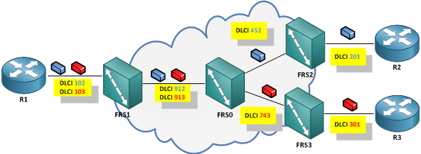
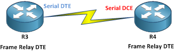

# Frame Relay 101

Frame Relay is a Layer 2 WAN technology that uses the concept of virtual circuits to transport data. The Frame Relay network is packet switched, but packets towards a destination share a common label, so they follow a strict path according to the label, giving the impression of an end-to-end circuit to the upper layer protocols.

## Understand what device you are configuring

Usually, devices in a Frame Relay network have 2 main roles: The customer **Frame Relay Router** and the provider **Frame Relay Switch**. I like to call them like this because it makes the difference more clear between the 2 roles. One difference between a switch and a router is that, typically, a router makes forwarding decisions based on the Layer 3 address, and a switch based on the Layer 2 address. In Frame Relay, the customer router will receive or create a Layer 3 packet. It will look at its destination address and based on the routing table it will have to forward it over a Frame Relay interface. To do this, it will have to encapsulate the Layer 3 packet into a Layer 2 “frame” before sending it out the Frame Relay interface. The next device on the link is the provider Frame Relay Switch, which will forward the frame based only on the Layer 2 information, without looking at Layer 3. This is why the devices in the provider’s Frame Relay cloud are called Frame Relay Switches.

It is important to understand what device you are configuring because the configuration differs on a Frame Relay Router from the one on a Frame Relay Switch.

Most of the time you will see that the Frame Relay Router is called the DTE device, and the Frame Relay Switch is called the DCE device.

In Telecommunications, DTE is a Data Terminal Equipment and is the last device in a communication line, while DCE is the Data Communication Equipment and is the device that the DTE connects to, in order to access the communication path. This is why the interface on the Frame Relay Router is defined as DTE interface, while the interface on the Frame Relay Switch is defined as DCE interface. What about interfaces between Frame Relay Switches? They are called NNI – Network to Network Interface.

Let me point out that this denomination is different from the DTE and DCE ends of a serial connection, because even though the Frame Relay DCE device is usually the DCE end of the link and the DTE device is usually the DTE link, the connection can still work if the Frame Relay DTE device is the DCE end of the link and the Frame Relay DCE device is the DTE end of the link



## DLCI (Data Link Connection Identifier)

As I said earlier, the Frame Relay network offers a virtual circuit to the upper layer protocols, by encapsulating the Layer 3 information in the Layer 2 frames, and by marking each frame with its appropriate Data Link Connection Identifier. The name says it all. The DLCI will identify the virtual circuit that each frame belongs to. One thing that must be remembered here is that the DLCI identifies the circuit on a link by link basis. This means that the the same virtual circuit will be identified by different DLCI values on each link from the source to the destination.

In the example below, R1 uses 2 different circuits to reach R2 and R3 respectively. R1 will encapsulate traffic for R2 in frames with DLCI set to 102 and will send them towards FRS1. FRS1 knows it must take frames with DLCI 102 and send them towards FRS0 with DLCI set to 912. When FRS0 receives frames with DLCI 912 will switch them over to FRS2 and will change the DLCI to 452. As the last device in the Frame Relay Cloud, FRS2 will forward the frames to R2 but it will also replace the DLCI value with 201. The same process happens for traffic from R1 to R3, but this time the DLCIs used are 103, 913, 743 and 301


## Encapsulation types – CISCO and IETF

To complicate thinks a bit, there are different type of encapsulations that can be used. Cisco routers default to _**cisco**_ encapsulation, but there is also an _**ietf**_ encapsulation available, that should be used when connecting to non-Cisco devices. Luckily, many other devices support _cisco_ encapsulation, but also, Cisco devices work even with a mismatched encapsulation. They will send packets with the defined encapsulation but will accept packets with either encapsulation. So in real life there is no need to worry about this, but it is recommended to match the encapsulation even for the often underrated reason of readability.

```
R(config)# interface serial1/0
R(config-if)#encapsulation frame-relay ?
 MFR Multilink Frame Relay bundle interface
 ietf Use RFC1490/RFC2427 encapsulation
 
```

Even if it is not very clear, we should understand that hitting enter will set the encapsulation to _cisco_, while the other options are _ietf _and [_MFR_](https://nyquist.eu/multilink-frame-relay/).

To see the encapsulation type used on an interface use:

```
R1#show interface s1/0 | i Encapsulation
 Encapsulation FRAME-RELAY, crc 16, loopback not set
```

Another important topic here is that the frame-relay encapsulation must match **end-to-end**, that is between the DTE devices, and not between the DTE and the DCE. There is something else that should match between the DTE and the DCE and that is the LMI Type.

You will see later that encapsulation can be different on each virtual circuit, but by default, each virtual circuit will inherit the settings on the interface. To see how encapsulation actually looks like, you should read this article about [Frame Relay Encapsulation](https://nyquist.eu/frame-relay-encapsulations-ietf-vs-cisco/)

## LMI types – CISCO, ANSI, Q933A

Frame Relay started in the mid 1980’s when both [ITU-T](https://en.wikipedia.org/wiki/ITU-T) (known at the time as CCITT) and [ANSI](https://en.wikipedia.org/wiki/American\_National\_Standards\_Institute) where trying to standardize the technology, but it took off at the beginning of the 1990’s when “The Gang of Four” – Cisco, StrataCom, Northern Telecom and DEC – created a consortium that would focus on accelerating the introduction and interoperability of Frame Relay products. The most important development they came up with, was the LMI – Local Management Interface, which is a set of extensions complementary to the  existing Frame Relay standards that add several new features to it, like Virtual Circuit Status Messages, Multicasting or Global Addressing. Support for Multicasting and Global Addressing extensions is optional, but VC Status Messages is expected to be implemented by most vendors.

VC Status Messages offers a very useful service for Frame Relay, that gives an end-to-end status of the virtual circuit from one DTE to another. The status of a virtual circuit can be ACTIVE, INACTIVE or DELETED.

For a quick view of the status of each virtual circuit, I use:

```
R1#show frame-relay pvc | i DLCI
DLCI = 102, DLCI USAGE = SWITCHED, PVC STATUS = ACTIVE, INTERFACE = Serial1/0
DLCI = 103, DLCI USAGE = SWITCHED, PVC STATUS = ACTIVE, INTERFACE = Serial1/0
```

An **ACTIVE** status means everything is OK and the virtual circuit can be used to send data from one DTE to another.

An **INACTIVE** status means the virtual circuit is not completed, but the problem is not on the local link between the DTE and the DCE, but beyond the first DCE, in the provider network or at the other end of the connection.

A **DELETED** status means the DTE and the DCE do not have the same information regarding the virtual circuit. Most often, the virtual circuit on the DTE is configured with a different DLCI than on the DCE.

To set the LMI type, you use the command below to select either Cisco, ANSI Annex D or ITU Q933-A (Annex A)

```
R1(config-if)#frame-relay lmi-type ?
 cisco
 ansi
 q933a
```

but probably the best option would be to just let the default **LMI auto-sense** to work. This feature, available on Cisco routers, will discover the LMI type used by the DCE device and will use it. To enable auto-sense, if an lmi-type has been already set, use:

```
R1(config-if)#no frame-relay lmi-type
```

To see the LMI type that is used:

```
FRS1#show frame-relay lmi | i interface
 LMI Statistics for interface Serial1/0 (Frame Relay NNI) LMI TYPE = CISCO
 LMI Statistics for interface Serial1/1 (Frame Relay DCE) LMI TYPE = CISCO
 LMI Statistics for interface Serial1/2 (Frame Relay DCE) LMI TYPE = CISCO
```

You can also see what DLCI is used for LMI, with:

```
R3#sh int s1/1 | i LMI DLCI
  LMI DLCI 1023  LMI type is CISCO  frame relay DTE
```

| LMI Type | Listens on | Available DLCIs |
| -------- | ---------- | --------------- |
| Cisco    | 1023       | 16-1007         |
| ANSI     | 0          | 16-991          |
| ITU      | 0          | 16-991          |

LMI Status inquires are sent every 10 sec by default (show as type1 in debug frame LMI)

```
R(config-if)# keepalive SEC
! Default: 10
```

Full Status updates are sent every 6th inquiry (show as type0 in debug frame LMI)

```
R(config-if)# frame-relay lmi-n391dte COUNT
! Default: 6
```

DTE will report the status of each configured DLCI. The MTU size limits the number of DLCIs on a link. When using an MTU of 1500 Bytes a maximum only 296 DLCIs can be included in one status message. If the DCE device doesn’t receives 3 LMI Status messages it considers the link down.

## Back-to-Back Frame Relay



The Back-to-Back Frame Relay configuration is one where, God knows why, you would want to connect to routers on a serial link using Frame Relay encapsulation. First, we will have to enable frame-relay encapsulation and set a Layer 3 address

```
! On R3
R3(config-if)# encapsulation frame-relay
R3(config-if)# ip address 134.0.0.3 255.255.255.0
R3(config-if)# no shut
! On R4
R4(config-if)# encapsulation frame-relay
R4(config-if)# ip address 134.0.0.4 255.255.255.0
R3(config-if)# no shut
```

As we saw at the beginning, a Frame Relay router expects to be the DTE end of the link so it must connect to a DCE device. But this time, both devices are DTE devices. In order to make the link operational, one device must become the serial DCE device and this is done by setting clock rate on the interface. Use “?” to see all available clock rates.

```
R4(config-if)#clock rate CLOCKRATE
```

\* In newer version of the IOS, this is not needed anymore as all serial interfaces have a default clock rate, but only the DCE uses it.\
Each router still thinks it is a Frame Relay DTE, so by default it expects to communicate over LMI with the DCE device. Unless LMI is disabled, the link will not come up! So next thing to do is to disable LMI on both ends using:

```
R3(config-if)# no keepalive
R4(config-if)# no keepalive
```

One more thing must be done to achive connectivity. The routers must agree on the DLCI to use. This can be done by assigning a DLCI to the interface and using Inverse ARP, or by setting up a static mapping between IP and DLCI, but we’ll see how this works in the [next episode](https://nyquist.eu/frame-relay-101-part-2/).

## Frame Relay End-to-End Keepalives

End-to-end Keepalives are a different kind of keepalive, that test the end-to-end connectivity over Frame Relay, that is from one DTE to another. This way, the status of the PVC can be better monitored.\
To enable EEK, first you must define a map-class:

```
R(config)# map-class frame-relay MAP-CLASS
R(config-map-class)# frame-relay end-to-end keepalive mode {bidirectional|request|reply|passive-reply}
```

The EEK works by sending a Request on one side, and replying with a response to it on the other side. Each side can don both or any of these actions.

* **Bidirectional**: This end will both send requests and reply to requests. The other end must be bidirectional also in order to work. Used when the upstream path is different from the downstream path
* **Request**: This end will only send and wait for replies. The other end must be set to reply or passive-reply in order to work
* **Reply**: This end will only respond to requests. The other end must be set to Request in order to work
* **Passive-reply**: This end will reply but will not track the requests received. The other end must be set to Request in order to work

The keepalive configuration can be done with the following commands:

```
R(config-map-class)# frame-relay end-to-end keepalive error-threshold {recv|send} VALUE
! Default: 2 = number of errors in event-window that move the interface down
R(config-map-class)# frame-relay end-to-end keepalive event-window {recv|send} VALUE
! Default: 3 = how many events to monitor. Default: last 3
R(config-map-class)# frame-relay end-to-end keepalive success-events {recv|send} VALUE
! Defaut: 2 = number of errors in event-window that move the interface up
R(config-map-class)# frame-relay end-to-end keepalive timer {recv|send} VALUE
! Default: 10 sec
```

Finally, apply the map-class on the frame-relay interface, using:

```
R(config-if)# frame-relay class MAP-CLASS
```

To monitor, use:

```
R# sh frame-relay end-to-end keepalive [interface INTERFACE]
```
