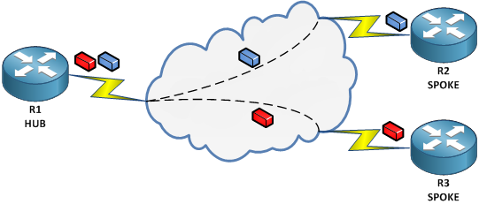

# Frame Relay 102

If you thought the [previous Frame Relay 101](frame-relay-101.md) would cover all basic aspects of Frame Relay, you were wrong. Here’s more info on Frame Relay and how it works, and believe me, we are looking just at the tip of the iceberg here :)



## Non-Broadcast. What difference does it make?

The omnipresent nowadays Ethernet networks rely on the broadcast properties of its medium. On Ethernet networks, there is an address that can be used to send frames to all hosts in a network. That is the FF:FF:FF:FF:FF:FF MAC Address. The first advantage of such an address is that a host that doesn’t know the Layer 2 address of a Layer 3 host can ask for it using this broadcast address. Everybody will receive the interrogation but only the holder of the Layer 3 address should respond to it. (I will not get into Proxy ARP or security issues here and I will assume that everybody plays nicely). When the first host receives the reply, it will have information needed to send the Layer 3 packet encapsulated in the Layer 2 Ethernet Frame. This looks simple enough and works like a charm but unfortunately, this doesn’t work on a Frame Relay network because there is no DLCI (Framer Relay Layer 2 address) that can be used to reach all other hosts. So how do we find out the Layer 2 address of a host?

### Static mapping

On Cisco routers you can statically define the DLCI to use for a certain destination. The command is applied on the interface and it looks like:

```
R(config-if)# frame-relay map PROTOCOL ADDRESS DLCI
! Example:
R(config-if)# frame-relay map ip 100.0.0.2 102
```

Why do I need to specify the protocol? That’s because Frame Relay can transport not just IPv4, but also IPv6 or CLNS. The address field is the Layer3 address of the destination according to the specified protocol. Here’s an example for an IPv6 mapping

```
R(config-if)# frame-relay map ipv6 2001::2 102
```

You can add more options after the DLCI. One of them is the encapsulation type. This will make the traffic on the specific virtual circuit to be encapsulated with either _cisco_ or _ietf_ format. The encapsulation set here can be different from the interface encapsulation. Actually, this is when you will most probably use it, when the traffic for a virtual circuit identified by a specific DLCI should not inherit the interface encapsulation.

```
R(config-if)# frame-relay map ip 100.0.0.2 102 {cisco|ietf}
```

Another option is the broadcast keyword. This enables support for pseudo-broadcast on Frame Relay. When the upper layer protocol knows it sends a broadcast packet, it will inform the Frame Relay process of this, and Frame Relay will send the frame on all the virtual circuits marked with the broadcast keyword.

```
R(config-if)# frame-relay map ip 100.0.0.2 102 broadcast
```

Now there’s a catch: In a Hub-and-Spoke topology, it is common for one spoke to use the path to the hub to reach the other spokes. This means that you end up using the same DLCI for each destination. The pseudo-broadcast feature will look at all the Layer 3 to DLCI mappings and when it will see the broadcast keyword it will send the frame out that virtual circuit. When having more mappings with the same DLCI, the packet will be sent several times on the same virtual circuit. Although this is not wrong, it is sub-optimal and in real life scenarios you should send the packet only once. How can we achive this? By marking only one mapping with the broadcast keyword. The other mappings involving the same DLCI will be set without the broadcast keyword.

### Inverse ARP aka Dynamic Mapping

Of course, we had to have an automatic mechanism for Layer 3 to Layer 2 mappings. Making just manual configurations could mean a lot of work in a large network. So we can’t use ARP like in Ethernet, but we can use another form of ARP, that is rightly named Inverse ARP. That is because in Frame Relay, when an interface is configured with an IP Address and a virtual circuit becomes active, the router will send an Inverse ARP packet asking who is on the other end of the link. It will also send information about it’s own address. The router on the other end will reply with it’s IP address and will also add the information it received to it’s frame-relay maps.

You can see a packet capture of the process in this [Frame Relay Inverse ARP Packet Capture](https://www.cloudshark.org/captures/87be3b4b6625). The capture lists 4 packets, but actually they are only one request and one response, but seen on both ends of the same virtual circuit. Notice that the DLCI changes from 201 in one frame to 102 on the other end. Also, you might be set off by the question “Who is 3091?” Well, if you look closely, 3091 is actually the HEX value of the entire [Q.922 address](https://nyquist.eu/frame-relay-encapsulations-ietf-vs-cisco/) in the first request. This value is carried within the ARP header over the frame relay cloud as the “Target Hardware Address”,  even though the DLCI changes from 201 to 102 in the Frame Relay header.

To see the Layer 3 to Layer 2 mappings use the command below. Mappings marked as dynamic are learned through Inverse ARP while those marked with static are manually configured. The example also shows different types of Layer 3 protocols used over the same DLCI. It si important to notice that the dynamically learned mappings support the pseudo-broadcast.

```
R1# show frame-relay map

Serial1/0 (up): ip 99.0.0.2 dlci 102(0x66,0x1860), dynamic,
broadcast,
IETF, status defined, active
Serial1/0 (up): ipv6 2002::6300:2 dlci 102(0x66,0x1860), static,
IETF, status defined, active
```

One more thing worth mentioning here is that Inverse ARP must find out what DLCIs it can use to find the other end’s IP address. In most configurations, where a router connects to the provider Frame Relay switch, Inverse ARP cannot work without LMI because LMI tells the router what virtual circuits are ACTIVE. However, when configuring Back-to-Back Frame Relay, that is 2 Frame Relay DTEs connected to eachother, LMI must be disabled but Inverse ARP will still work because the DLCI is assigned to the interface.

Inverse ARP requests are sent by default every 60 sec and the mappings are cached until they are cleared or the interface is reset. Also, remember that a static mapping will always overwrite a dynamic mapping!

## Frame Relay subinterfaces – point-to-point or multipoint

Every Frame Relay interface can have one or more subinterfaces. The important thing to remember is that subinterfaces can be point-to-point or multipoint. To define a subinterface, use:

```
R(config)# interface INTERFACE
R(config-if)# encapsulation frame-relay
R(config-if)# interface INTERFACE.SUBIF {point-to-point|multipoint}
```

What’s the difference?

A multipoint interface can have multiple virtual circuits assigned to it. Basically, there are multiple DLCIs that are used to transport traffic on a single interface. The physical interface and a multipoint subinterface enter in this category.

A point-to-point subinterface only uses one virtual circuit so only one DLCI is used to carry traffic. What is the advantage?

First of all, using separate point-to-point subinterfaces simplifies the design. One DLCI is assigned per sub-interface and traffic from one virtual circuit to another is routed as if there are separate physical interfaces. Plus, no need to worry about Split Horizons rules. In a multipoint interface updates that come in on one DLCI should be also advertised on the same interface on another DLCI. Layer 3 process doesn’t care about the DLCIs. It knows a routing update came on one interface, it will not send it back the same interface if split horizons rule apply (RIP and EIGRP).

The second advantage is that if there is only one DLCI per subinterface, then there is no need for Inverse ARP. Whatever we have to send, the interface will just encapsulate it with the assigned DLCI.\
On point-to-point subinterfaces you should also assign the DLCI:

```
R(config-subif)# frame-relay interface-dlci DLCI
```

You can only set one DLCI on point-to-point subinterfaces. In contrast, on multipoint interfaces or subinterfaces you can assign multiple DLCIs using the previous command several times. You will still have to map the Layer 3 to Layer 2 addresses in order to send the packet, otherwise encapsulation fails.\
When using LMI, all active DLCIs are associated to the physical interface. Using the above command you can assign DLCIs to other interfaces in order to help the Invers ARP process to make the correct mappings.

Another difference between point-to-point and multipoint interfaces is that while a point-to-point subinterface will change its protocol status to down when the assigned DLCI is not active, while for a multipoint subinterface or a physical interface, the protocol status is not affected by the PVC status.

## Disabling Inverse ARP

Can I disable Inverse ARP? Not entirely. You can disable the sending of ARP requests but you cannot disable responding to ARP requests. This is even more trickier than it sounds. If you disable ARP response on your end but the other end of the virtual circuit sends an ARP request to you, your router will respond to it. The other router receives the information and adds it to it’s dynamic mappings, but you could be surprised to find out that even your own router used the information it received and added the other end’s address to its dynamic mappings. So you disabled ARP but ARP still works. It must be disabled on both ends to stop working completly. Inverse ARP can be disabled on an interface, on a PROTOCOL or on a DLCI using the following command:

```
R(config-if)#no frame-relay inverse-arp {PROTOCOL [DLCI]}
```

Another option for disabling Inverse ARP on just some DLCIs is more of a trick. You assign those DLCIs to a subinterface that does not run IP. When does an interface not run IP? When there is no IP address assigned to it.

## Final thoughts

There is a lot more to talk about Frame Relay, and I will post more tips and tricks, but I think this is enough for a brief introduction. Here are a few things to remember:

* Frame Relay is a Layer 2 protocol. This means that the Frame Relay Cloud is transparent to the **traceroute** command
* Look for the status of the PVC – this will indicate if there is a configuration issue – using **show frame-relay pvc**
* Issue the **show frame-relay map** command to see the Layer 2 to Layer 3 mappings. Without proper mapping encapsulation will fail
* Frame Relay is a non-broadcast network so you have to pay special attention when dealing with broadcast and multicast traffic. Try to **ping 255.255.255.255 repeat 1** to see that everybody is responding.
