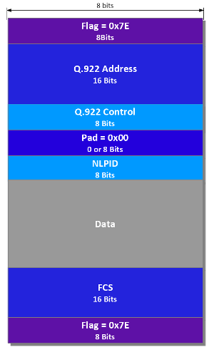
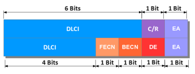

# Frame Relay Encapsulations – IETF vs Cisco

When configuring a Frame Relay interface, the first thing you should do is enable Frame Relay Encapsulation. This is usually a fairly simple task, just use the classic **encapsulation frame-relay** command and it will work. Actually there are 3 options:

```
R(config)# interface serial1/0
R(config-if)#encapsulation frame-relay ?
 MFR Multilink Frame Relay bundle interface
 ietf Use RFC1490/RFC2427 encapsulation
 <cr >
 
```

The first one is [MultiLink Frame Relay](https://nyquist.eu/multilink-frame-relay/) but this deals with a particular architecture, so the primary options are **ietf** and **cisco**. Cisco is selected by default when you just hit enter.

## IETF vs Cisco Encapsulation

Encapsulation is the process of taking the upper layer information and wrapping it up with a new header and trailer before sending it to a lower layer. When we talk about Frame Relay, which is a Layer 2 protocol, the lower layer is the Physical Layer, so it is practically the first/last logical layer in the OSI stack



On the ~~left~~  top you can see how the IETF encapsulation looks like, according to [RFC1490](https://tools.ietf.org/html/rfc1490)/[RFC2427](https://tools.ietf.org/html/rfc2427). The Frame is delimited at the beginning and at the end with an 8 bits **Flag** that is always set to 0x7E.

In the next 16 bits (can grow up to 32 bits) is the **Q.922 Address** portion of the Frame. You will see the value of this field in several show commands on Cisco routers. Inside the Q.922 Address, there is also the DLCI.

Next is the **Q.922 Control** field. This field is missing in the Cisco encapsulation.

Next there is an optional **Padding** field. When used, it has an 8 bit value of all zeros with the goal of aligning the data field to start exactly after a multiple of 16 bits chunks.

The **NLPID** field is used to identify the upper layer protocol . Cisco encapsulation also has a **Type** field that has the same function but the values used to identify the protocols are different. For example, IPv4 is identified as 0xCC by IETF and 0x0800 by Cisco.

Next is the **Data** field which has a variable size.

At the end we have a **FCS** field used for error checking and again the **Flag** Field that signals the end of the frame.

### 2. The Q.922 field – Here’s DLCI!

The Q.922 field, also known as the Q.922 Address contains the DLCI along with other options for the particular frame



The **DLCI** is split between the 2 Bytes of the Q.922 field, in two chunks of 6 and 4 bits. That makes up for 10 bits, so the DLCI values that could be used theoretically should be in the range 0 – 1023. In practice, depending on the type of LMI used, only a subset of these can be used, while others are reserved.

The **C/R** field in the first Byte is used to signal if the frame is a Command or a Response.

The **EA** field is also split and it signals the possibility of expanding the address field with up to 2 additional bytes, offering a bigger address space.

The **FECN** and **BECN** fields are used for the mechanism of Explicit Congestion Notification. Frames marked with the FECN bit signal a congestion in the downstream direction, that is from the sender to the receiver, while frames marked with the BECN bit signal a congestion in the upstream direction, that is from receiver to sender.

The **DE** bit stands for Discard Eligible and the frames marked with it can be discarded if there is a congestion along the way. Usually, when buying a Frame Relay service, the provider offers a CIR value – Committed Information Rate, that is guaranteed to be delivered. If the customer sends data at a rate that is over the CIR value, the offending frames are not discarded, but they are marked with the DE bit and could be discarded in the event of a congestion on the path to the destination.

### 3. Final thoughts

In theory, the encapsulation should be matched between DTE devices at the end of the PVC. Also in theory, **ietf** encapsulation should be used when connecting Cisco devices to non-Cisco devices. In real life though, there are rarely any problems with this because many other devices support **cisco** encapsulation, but also because Cisco devices work even with a mismatched encapsulation. They will send packets with the defined encapsulation but will accept packets with either encapsulation.
