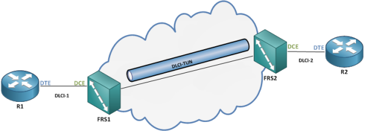

# Frame Relay Switching

## Frame Relay Switching

When setting up a Frame Relay DCE device, we need to follow the following steps.\
1\. Enable Frame Relay Switching\
2\. Change The interface type\
3\. Glue the DLCIs together

### Enable Frame Relay Switching

The command is ultra simple, but without it the device will try to decapsulate the frames and look up the Layer 3 information. This is not needed on a Frame Relay Switch.

```
FRS(config)# frame-relay switching
```

### Change the interface type

Interfaces connected to DTE routers must be set to DCE to enable LMI

```
FRS(config-if)# frame-relay intf-type dce
```

On interfaces connecting to other Frame Relay switches, the type must be set to nni – Network-to-Network Interface

```
FRS(config-if)# frame-relay intf-type nni
```

### Glue the DLCIs together

There are 2 methods for connecting a DLCI on an interface to a DLCI on another interface. The old method needed two commands, one for each interface, like this:

```
FRS(config)# interface INTERFACE-1
FRS(config-if)# frame-relay route DLCI-1 interface INTERFACE-2 DLCI-2
FRS(config-if)# exit
FRS(config)# interface INTERFACE-2
FRS(config-if)# frame-relay route DLCI-2 interface INTERFACE-1 DLCI-1
```

To verify, use:

```
FRS#sh frame-relay route
Input Intf 	Input Dlci 	Output Intf 	Output Dlci 	Status
Serial1/1       102 		Serial1/2       201 		inactive
Serial1/2       201 		Serial1/1       102 		inactive
```

The newer method needs just one command in the global config:

```
FRS(config)# connect CONN-NAME INTERFACE-1 DLCI-1 INTERFACE-2 DLCI-2
```

and to verify, use:

```
FRS1#sh connection all

ID   Name               Segment 1            Segment 2           State       
========================================================================
1    R1R2              Se1/1 102            Se1/2 201            UP          
```

## Switching over a Tunnel interface

There are situations where you have Frame Relay routers as Provider edge, but use another technology as the Provider Core. You can still perform Frame Relay Switching by tunneling the Frames from one PE router to another



\
You must configure the frame relay interfaces similarly on the two Frame Relay switches and then configure the Tunnel interface on each router:

```
FRS(config)# interface TUNNEL0
FRS(config-if)# tunnel source {INTERFACE|SRC-IP-ADDR}
FRS(config-if)# tunnel destination {INTERFACE|SRC-IP-ADDR}
FRS(config-if)# ip {unnumbered INTERFACE| address TUN-IP-ADDR}
```

Then create the frame-relay routes, making sure you use the same DLCI on the Tunnel interface on both routers:

```
!On FRS1
FRS1(config)# interface INTERFACE-1
FRS1(config-if)# frame-relay route DLCI-1 interface TUNNEL0 DLCI-TUN
!On FRS2
FRS2(config)# interface INTERFACE-2
FRS2(config-if)# frame-relay route DLCI-2 interface TUNNEL0 DLCI-TUN
```

You cannot use the connect command to create the routes.
