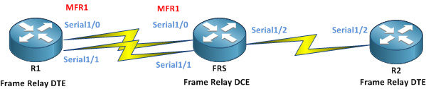

# Multilink Frame Relay

Frame Relay can be used to group multiple physical interfaces in one logical interface, much like an EtherChannel interface available on the Ethernet Switches. It offers load-balancing and higher availability since the link will be up as long as one physical connection is up.

In order to do this, bothe the DTE and DCE device must be configured to support this configuration. As you will see, this is not an end-to-end configuration, but rather a local config, between the DTE and the local DCE. The DCE will switch the frames to the other DTEs just as with normal Frame Relay encapsulation



## First DTE

```
!On R1:
R1(config)# interface mfr1
R1(config-if)# ip address 123.0.0.1 255.255.255.0
R1(config-if)# exit
R1(config)# interface serial1/0
R1(config-if)# encapsulation frame-relay mfr 1
R1(config-if)# no shut
R1(config-if)# exit
R1(config)# interface serial1/1
R1(config-if)# encapsulation frame-relay mfr 1
R1(config-if)# no shut
```

## Frame Relay Switch

```
!On FRS:
FRS(config)# frame-relay switching
FRS(config)# interface mfr1
FRS(config-if)# frame-relay intf-type dce
FRS(config-if)# exit
FRS(config)# interface serial1/0
FRS(config-if)# encapsulation frame-relay mfr 1
FRS(config-if)# no shut
FRS(config-if)# exit
FRS(config)# interface serial1/1
FRS(config-if)# encapsulation frame-relay mfr 1
FRS(config-if)# no shut
FRS(config-if)# exit
! FRS connects to R2 overs serial 1/2
FRS(config)# interface serial1/2
FRS(config-if)# encapsulation frame-relay
FRS(config-if)# frame-relay intf-type dce
FRS(config-if)# no shut
FRS(config-if)# exit
! Now let's glue them together:
FRS(config)# connect R1_R2 mfr1 102 Serial1/2 201
```

## Second DTE

```
!On R2
R2(config)# interface serial1/2
R2(config-if)# ip address 123.0.0.2 255.255.255.0
R2(config-if)# encapsulation frame-relay
R2(config-if)# no shut
```

## Verification

The logical MFR1 interface can be used just like a physical frame-relay interface. It can also be set up with subinterfaces. By default, dynamic Inverse ARP mappings will be assigned to the Multilink interface:

```
R1#sh frame-relay map
MFR1 (up): ip 123.0.0.2 dlci 102(0x66,0x1860), dynamic,
              broadcast,, status defined, active
```

To verify the status of a Multilink bundle use:

```
R1#sh frame-relay multilink 
Bundle: MFR1, State = up, class = A, fragmentation disabled
 BID = MFR1
 Bundle links:
  Serial1/0, HW state = up, link state = Up, LID = Serial1/0
  Serial1/1, HW state = up, link state = Up, LID = Serial1/1
```
