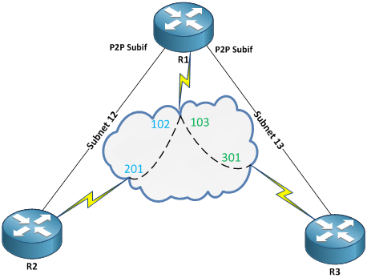

# Routing over Frame Relay

## Topologies

### Full Mesh


The simplest Frame Relay topology is the Full Mesh topology, where each router has a dedicated virtual circuit to another router. Unfortunately this design is rarely found in real life because each additional circuit costs. Of course, having so many circuits available makes it easy to use any kind of links. The simplest method here is to use multipoint interfaces with different mappings (static or dynamic) for each router, but with all of them in the same subnet. Of course, you can also use point-to-point sub-interfaces with different subnets, but this is not a scalable solution.

### Hub and Spoke

In a hub and spoke topology we have one central router with connections to all other routers. The spokes do not have direct circuits between each other, they can only communicate via the Hub. To make things work you can use several point-to-point interfaces on the Hub with a different subnet on each link to a spoke, or you can use a multipoint interface with a single subnet for all routers



While it is more cost effective, this topology introduces several challenges, like:

* **Mapping** – On each spoke, the inverse ARP will only resolve the Hub. Therefore static mapping for the other hosts is needed in order to enable communication between the spokes.
* **Broadcasts** – The hub will have to route between the 2 DLCIs in order to pass traffic from one spoke to another. This means that broadcast traffic will not be forwarded between spokes.
* **TTL** – When routing on the bridge TTL is decremented. This will be a problem when sending traffic with TTL=1 as in OSPF or eBGP. One option is to create a bridge between interfaces in order not to route the packet and to avoid TTL decrementation.

## IPv4 Routing Issues

The following considerations regard a Hub-and-Spoke topology with the hub using a multipoint subinterface. This topology has the most issues when trying to run a routing protocol over it. Using several point-to-point subinterfaces simplifies the connectivity model. Also, a multipoint subinterface works just like a physical Frame Relay subinterface, but it needs additional configurations because LMI assigns the DLCIs to the physical interface and so it helps automatic detection for Frame Relay mappings using Inverse ARP. Physical interfaces also have split-horizons for RIP disabled by default, which helps convergence. On Subinterfaces it has to be manually disabled. Split Horizons for EIGRP is enabled by default on all interfaces.

### RIP

1. RIPv1 uses broadcasts and RIPv2 uses multicast to send routing updates, so first of all, the DLCIs have to be able to transport broadcasts.
2. Since updates are sent as broadcast or multicast, the updates sent by one spoke will reach the hub but will not reach the other spokes. (Broadcast/Multicast traffic si not routed). Solutions:
   * The hub should forward the updates to all spokes, but the Split Horizons rule prevents this. It should be disabled using **no ip split-horizon **at the (sub)interface level. The next-hop address for all routes will point to the Hub’s IP address
   * If Split Horizon cannot be disabled, then we should send the updates as unicast from one spoke to another. This requires that each spoke declares its neighbors with **neighbor NEIGH-IP** command inside the routing process. The next-hop for spoke routes will point to each spoke’s IP address so we will also need mappings for the neighbors address on the (sub)interface.
   * You could also create a tunnel interface between the spokes but this will turn the topology into a Pseudo-Full-Mesh
3. Cisco routers send RIP messages with TTL=2, so they will not be affected by a TTL decrement on the Hub.

### EIGRP

1. EIGRP uses multicast to send routing updates, so first of all, the DLCIs have to be able to transport broadcasts.
2. Since updates are sent as broadcast or multicast, the updates sent by one spoke will reach the hub but will not reach the other spokes. (Broadcast/Multicast traffic si not routed). Solutions:
   * The hub should forward the updates to all spokes, but the Split Horizons rule prevents this. It should be disabled using **no ip split-horizon eigrp** at the (sub)interface level. The next-hop address for all routes will point to the Hub’s IP address
   *   By default, EIGRP will change the advertised next-hop address to the outgoing interface. This is why the spokes will have all EIGRP learned routes pointing to the Hub’s IP Address. This behavior can be changed if we configure the hub with:

       ```
       R(config-if)# no ip next-hop-self eigrp AS-NUMBER
       ```

       Now, the routes will point to each originating spoke’s IP address. We will then need frame-relay maps pointing to the spokes.
   * If Split Horizon cannot be disabled, then we should send the updates as unicast from one spoke to another. This requires that each spoke declares its neighbors with **neighbor NEIGH-IP INTERFACE** command inside the routing process. The next-hop for spoke routes will point to each spoke’s IP address so we will also need mappings for the neighbors address on the (sub)interface. Unlike RIP, when a neighbor is defined in EIGRP, it will disable multicast updates on that interface. We will have to define all spokes and the hub as neighbors with each other
   * You could also create a tunnel interface between the spokes but this will turn the topology into a Pseudo-Full-Mesh
3. Cisco routers send EIGRP messages with TTL=2, so they will not be affected by a TTL decrement on the Hub.

### OSPF

OSPF uses the concept of network type, which defines its mode of operation. By default, on Frame Relay physical interfaces and multipoint subinterfaces, the network type used is NON\_BROADCAST, while on point-to-point subinterfaces it is POINT\_TO\_POINT.

#### **Non Broadcast**

1. **Define neighbors**: Since it is considered a non-broadcast medium, all packets are expected to be sent as unicast so the neighbors must be statically defined. We will need mappings for each spoke on the hub, but the DLCIs don’t have to support broadcasts.
2.  **Force the Hub as the DR:**On NON\_BROADCAST networks a DR is elected. Since adjacencies are only formed with the DR, it should be forced on the Hub. To force the DR on the hub, use:

    ```
    R(config-if)# ip ospf priority 0
    ```

    on each spoke (sub)interface.
3. **Hellos/Dead timer: 30/120 sec**
4. Because OSPF packets are sent with TTL=1, spokes cannot become neighbors
5. The next hop address for the routes advertised by spokes, are set to the spoke’s IP address, therefore static mappings are required on each spoke, pointing to the other spokes.

#### **Point to Multipoint**

A better option for Frame Relay is to use the POINT\_TO\_MULTIPOINT network type. This type of network has the following characteristics:

1. **Neighbor auto-discovery:** Packets are sent as multicast so neighbors can be auto-discovered, but the DLCIs must support broadcasts
2. **No DR is elected**
3. **Hellos/Dead timer: 30/120 sec**
4. Because OSPF packets are sent with TTL=1, spokes cannot become neighbors
5. The next hop address for the routes advertised by spokes is changed to the hub’s address, so routes on the spokes will point to the hub. No need for additional mappings

#### **Point to Multipoint Non Broadcast**

The third option is the POINT\_TO\_MULTIPOINT\_NON\_BROADCAST network type. This network type is a mix of the POINT\_TO\_MULTIPOINT and the NON\_BROADCAST network types.

1. **Define neighbors**: Packets are sent as unicast so static nieghbors must be defined. Since traffic is unicast, DLCIs do not have to support broadcasts.
2. **No DR is elected**
3. **Hellos/Dead timer: 30/120 sec**
4. Because OSPF packets are sent with TTL=1, spokes cannot become neighbors
5. The next hop address for the routes advertised by spokes is changed to the hub’s address, so routes on the spokes will point to the hub. No need for additional mappings

#### **Point to Point**

This option is used by default on point-to-point subinterfaces. You can’t use this network type in a hup and spoke architecture because the hub will be expecting only one neighbor on the interface. However, you can have the hub configured to be POINT\_TO\_MULTIPOINT and the spokes to be POINT\_TO\_POINT (sub)interfaces as long as you configure the same HELLO and DEAD timers on each interface.

1. **Neighbor auto-discovery:** Packets are sent as multicast so the neighbor can be auto-discovered, but the DLCIs must support broadcasts. On point-to-point networks, you can’t define static neighbors.
2. **No DR is elected.**
3. **Hellos/Dead timer: 10/40 sec**
4. The next hop address for the routes advertised by spokes is changed to the hub’s address, so routes on the spokes will point to the hub. No need for additional mappings

#### **Broadcast**

Normally, you would not use this type of network on Frame Relay interfaces, but it will still work.

1. **Neighbor auto-discovery:** Packets are sent as multicast so the neighbor can be auto-discovered, but the DLCIs must support broadcasts. On point-to-point networks, you can’t define static neighbors.
2. **DR is elected**: Force it on the hub
3. **Hellos/Dead timer: 10/40 sec**
4. The next hop address for the routes advertised by spokes, are set to the spoke’s IP address, therefore static mappings are required on each spoke, pointing to the other spokes.

#### BGP

* BGP uses unicasts so there is no need for the DLCI to allow broadcasts.
* eBGP sends data with TTL=1. The solution is to use eBGP multihop.
* iBGP doesn’t change the next-hop when forwarding routes, so we might need to statically map the other spokes to the DLCIs.

## IPv6 Routing Issues

### RIPng

1. Fist, updates are sent as multicast, so DLCIs must allow multicasts to be sent.
2.  When seding updates, RIPng uses the Link-local address as the source, so all routes point to the link-local addresses. You must statically define mappings for these addresses in order to be able to resolve the next-hop layer 2 address. You will probably have to disable the RIP split Horizon rule, using:

    ```
    R(config)# ipv6 router rip PROCESS-NAME
    R(config-rtr)# no split-horizons
    ```
3. You can’t define static neighbors with RIPng
4. If you use multiple subinterfaces, you might see that the same link-local address is used for all subinterfaces of a serial link. This makes it impossible to map each destination to the DLCI it shoud use (since the same destination si already mapped on another DLCI). The solution is to manually define the link-local address.

### EIGRP for IPv6

1.  Fist, the EIGRP process must be enabled with:

    ```
    R(config)# ipv6 router eigrp AS-NUMBER
    R(config-rtr)# no shutdown
    ```
2. Then, updates are sent as multicast, so DLCIs must allow multicasts to be sent.
3.  When seding updates, EIGRP for IPv6 uses the Link-local address as the source, so all routes point to the link-local addresses. You must statically define mappings for these addresses in order to be able to resolve the next-hop layer 2 address. You will probably have to disable the EIGRP split Horizon rule, per interface, using:

    ```
    R(config-subif)# no ipv6 split-horizon eigrp AS-NUMBER
    ```
4.  You can define static neighbors with EIGRP for IPv6, using:

    ```
    R(config-rtr)# neighbor NEIGH-IPV6 INTERFACE
    ```

    but it will also disable multicast updates, so you will have to define neighbors on all routers
5. If you use multiple subinterfaces, you might see that the same link-local address is used for all subinterfaces of a serial link. This makes it impossible to map each destination to the DLCI it shoud use (since the same destination si already mapped on another DLCI). The solution is to manually define the link-local address.

### OSPFv3

The same considerations from IPv4 apply to IPv6. The default network type is NON\_BROADCAST. The network type can be changed with:

```
R(config-if)# ipv6 ospf network {broadcast|non-broadcast|point-to-point|point-to-multipoint [non-broadcast]}
```

1. When seding updates, OSPF for IPv6 uses the Link-local address as the source, so all routes point to the link-local addresses. You must statically define mappings for these addresses in order to be able to resolve the next-hop layer 2 address.
2.  You can define static neighbors with OSPFv3, per interface, using:

    ```
    R(config-subif)# ipv6 ospf neighbor NEIGH-IPV6 ...
    ```
3. If you use multiple subinterfaces, you might see that the same link-local address is used for all subinterfaces of a serial link. This makes it impossible to map each destination to the DLCI it shoud use (since the same destination si already mapped on another DLCI). The solution is to manually define the link-local address.

### MP-BGP

MP BGP supports IPv6 in a similar way as with IPv4. You just have to enable the [IPv6 Address Family](https://nyquist.eu/ipv6-routing/#61\_Start\_MP-BGP\_for\_IPv6). As a neighbor address you can use a unicast or a link-local address, but you will have to check if the correct mappings exist (no need for broadcast support, though).
