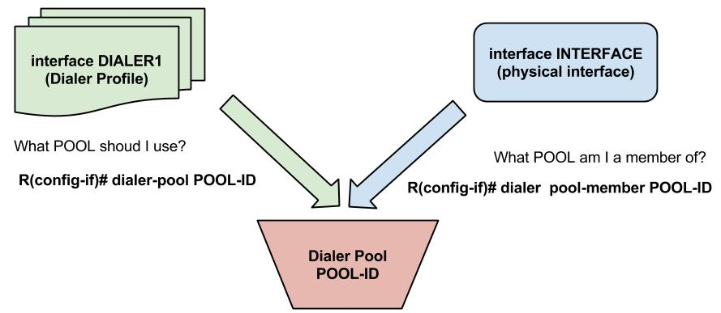

# PPPoE – PPP over Ethernet

PPP can be encapsulated over Ethernet and it can be used to offer authentication over Ethernet connections. It cannot be used for Multilinking Ethernet connections. When using PPPoE we need a server and a client.

## Server Side

Configuring the server makes use of the Virtual Template/Virtual Access interfaces. We configure the Virtual Template interface, but the Virtual Access interface will be up/up in the process. Its configuration will be taken from the Vitual Template interface.\
First define the Virtual Template that will hold the PPP configuration:

```
R1(config)# int VIRTUAL-TEMPLATE-INT
R1(config-if)# ip address IP-ADDR NETMASK
! define IP assignment for clients:
R1(config-if)# peer default ip address {CLIENT-IP | pool [IP-POOL]| dhcp-pool [DHCP-POOL] |dhcp}
```

See [PPP 101](https://nyquist.eu/ppp-101/#32\_Server\_Config) for details about client IP assignment.\
Then, configure the Broadband Access Group that points to the Virtual-Template interface:

```
R1(config)# bba-group pppoe {GROUP-NAME|default}
R1(config-bba-group)# VIRTUAL-TEMPLATE-INT
```

The last step is to enable PPPoE on the physical interface and assign it to the BBA-Group:

```
R1(config)# interface FAST-ETHERNET-INT
R1(config-if)# pppoe enable group {GROUP|default}
```

## Client Side

On the client side, we have to make use of Dialer Interfaces. Dialer Interfaces will look for a physical interface available in their Dialer Pool before initiating connections



```
R2(config)# interface DIALER1
! By default Dialer interfaces have encapsulation set to HDLC.
R2(config-if)# encapsulation ppp
!Get the IP address from the server
R2(config-if)# ip address {negotiated|IP-ADDR NETMASK}
R2(config-if)# dialer-pool POOL-ID
! What pool shoud I use?
```

Physical interfaces are assigned to Dialer Pools:

```
R2(config)# interface FASTETHERNET0
! Link the Ethernet Interface to the Dialer interface via the dial-pool.
R2(config-if)# pppoe-client dial-pool-number POOL-ID
! What pool am I a member of?
R2(config-if)# no shut
R2(config-if)# end
```

Additional information about Dialer Interfaces, can be found [here](https://nyquist.eu/ppp-101/#12\_Dialer\_Interface).

After a little while we will see the assigned IP address on the interface and the PPP /32 ip route:

```
R2#sh ip route
Gateway of last resort is not set

     1.0.0.0/32 is subnetted, 1 subnets
C       1.1.1.1 is directly connected, Dialer1
     99.0.0.0/32 is subnetted, 1 subnets
C       99.0.0.10 is directly connected, Dialer1

R2#sh ip int brie
Interface                  IP-Address      OK? Method Status                Protocol
FastEthernet0/0            unassigned      YES unset  up                    up
FastEthernet0/1            unassigned      YES unset  administratively down down
Virtual-Access1            unassigned      YES unset  up                    up
Dialer1                    99.0.0.10       YES IPCP   up                    up
R2#ping 1.1.1.1

Type escape sequence to abort.
Sending 5, 100-byte ICMP Echos to 1.1.1.1, timeout is 2 seconds:
!!!!!
Success rate is 100 percent (5/5), round-trip min/avg/max = 12/24/52 ms
R2#
```

If we want to enable authentication, just configure the PPP interfaces on each device, that is the Virtual-Template on the Server and the Dialer interface on the Client.
