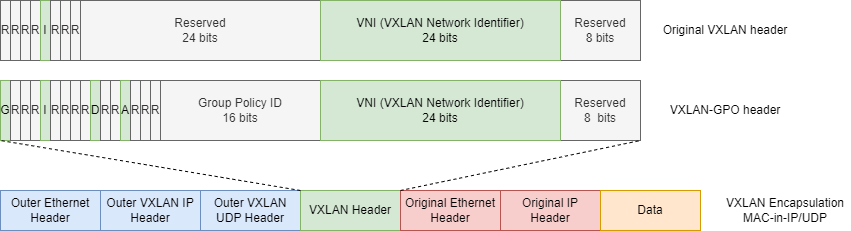

# SD Access

A fabric network is an overlay network built on top of the underlay network, the physical network. Fabric networks typically are built using tunneling technologies so thye can overcome limitations of traditional networks such as host mobility, lack of automation, difficulty of segmentation, difficulty of scalability.

Cisco SD Access is Cisco's campus network solution for an overlay fabric. It has 2 main components:&#x20;

* the fabric itself
* the solution to implement it and manage it. This solution can be:
  * Cisco DNA Center - and the ansamble is called Cisco SD Access
  * a combination of CLI or API calls using NETCONF/YANG - and the ansamble is called a campus fabric solution

## SD Access Physical Layer

The SD Access Physical Layer comprises of all network devices  that make up the network and the controller appliances

* Switches - provide LAN access to the fabric
* Routers - provide WAN and branch access to the fabric
* WLCs and WAPs - provide wireless access to the fabric
* Controllers: Cisco DNA Center and Cisco ISE

## SD Access Network Layer

The SD Access Network Layer consists of the underlay and the overlay networks.

### Underlay

The underlay is the physical network that is transporting data packets between network devices for the Overlay.&#x20;

The design goals for the Underlay are performance, scalability and high availability.&#x20;

The Underlay can be implemented as a traditional L2 network with STP but it is not recommended. Instead, the recommended method is to use Layer 3 Routed acces with IS-IS, but other routing protocols work as well.

The Underlay can be deplyed using:

* Cisco DNA Center via it's LAN Automation feature. It will implement an IS-IS route access campus design. While this option reduces the administrative complexity, it also reduces the customization options
* Using your own manual or home-grown automated CLI or API based management. It provides more customization options and allows you to chose your preferred routing protocols as well as re-use older networks to act as underlay.

### Overlay

The overlay is a virtual network that interconnects all network devices and provides all the additional features of SD Access.&#x20;

Even for overlay you can use Cisco DNA Center or your home-grown solution (manual or automated) but in the latter case it is not an "SD Access" solution, but rather a "Campus Fabric" solution

#### Control Plane

The SD Access Control Plane is based on **LISP** (Locator/ID Separation Protocol). LISP is a protocol that provides mapping between an Endpoint ID (EID) and a routing locator (RLOC). This approach allows for the separation between Endpoint IP and the location in the network.

LISP simplifies routing by moving remote destination information to a centralized database - LISP MS (Map Server) - which is a control plane node. This allows a router to maintain only its local routes and to ask the LISP MS for the location of destination EIDs.

Therefore LISP provides host mobility, address-agnostic mapping, smaller routing tables and built-in network segmentation through VRF instances.

#### Data Plane

VXLAN (Virtual Extensible LAN) is used to provide the data plane of SD Acess. It is an encapsulation technique based on UDP/IP which means it can be routed through an underlay network and creates the overlay network.&#x20;

VXLAN was preferred over LISP encapsulation because it also supports the encapsulation of the original MAC-in-IP, which LISP doesn't support. With this feature VXLAN can support virtual L2 networks or virutal L3 networks in the overlay.

The VXLAN Encapsulation takes the original L2 frame (Original Ethernet Header + Original IP Header + Data) and adds a VXLAN Header which is then encapsulated inside UDP>IP>Ethernet (Outer Ethernet Header + Outer VXLAN IP Header + Outer VXLAN UDP Header)

<figure><figcaption>
VXLAN Encapsulation
</figcaption></figure>

| Field          | Description                                                                     |
| -------------- | ------------------------------------------------------------------------------- |
| R (Reserved)   | set to 0. 1 bit, part of the 8 bit Flags field                                  |
| I (Identifier) | set to 1 for a valid VNI                                                        |
| VNI            | identifies the individual VXLAN Overlay network where the communication belongs |
| Reserved       | Set to 0                                                                        |

Cisco also supports a modified VXLAN-GPO (Group Policy Option) header that supports TrustSec Scalable Group Tags (SGTs)

| Field                                |                                                                                                                                                                                                                                                                                                                           |
| ------------------------------------ | ------------------------------------------------------------------------------------------------------------------------------------------------------------------------------------------------------------------------------------------------------------------------------------------------------------------------- |
| G (Group Based Policy Extension Bit) | set to 1 to indicate an SGT tag is included in the header                                                                                                                                                                                                                                                                 |
| R (Reserved)                         | set to 0. 1 bit                                                                                                                                                                                                                                                                                                           |
| I (Indetifier)                       | set to 1 for a valid VNI                                                                                                                                                                                                                                                                                                  |
| D (Don't Learn Bit)                  | set to 1 to indicate that the egress Virtual Tunnel Endpoint (VTEP) must not learn the source address of the encapsulated frame                                                                                                                                                                                           |
| A (Policy Applied Bit)               | When the G bit is set to 1, the A bit indicates that the group policy hasn't already been applied when it is set to 0. This means that policy must be applied and after that the bit is set to 1. When the bit is already set to 1 it means the policy has already been applied and further policies must not be applied. |
| Group Policy ID                      | SGT tag                                                                                                                                                                                                                                                                                                                   |
| VNI                                  | identifies the individual VXLAN Overlay network where the communication belongs                                                                                                                                                                                                                                           |
| Reserved                             | Set to 0                                                                                                                                                                                                                                                                                                                  |

#### Policy Plane

The policy plane is based on Cisco TrustSec. With Cisco TrustSec, SGTs are assigned to authenticated groups of users or end devices. These SGTs can than be used for QoS, routing or network segmentation policies instead of using traditional L2 or L3 header fields.

#### SD Access Fabric Roles



This node provides the EID-to-RLOC (Endpoint to Location) mapping



This node connects other L3 networks to the fabric



This node connects wired endpoints to the fabric. The edge node provides



This node connects APs and wireless endpoints to the fabric




These nodes are used to connect the other nodes and only provide underlay services



****

