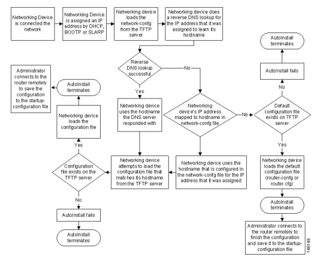

# AutoInstall

## AutoInstall Process

The autoinstall process discribed in the following paragraphs is used in autoconfiguration of a clean router (no config) over an IP network. The following flowchart best describes this process



Here are some details about the AutoInstall steps:

### Assign IP Address

The first step in the AutoInstall process is for the router to receive an IP Address. The method used differs according to the the encapsulation of its interfaces.

#### **Ethernet – DHCP**

On Ethernet interfaces, a router will send DHCP requests in order to receive an IP Address. Depending on the network architecture, the DHCP server might be on the same network segment and no additional configuration is required, or it might be on a different network segment. In the last case, the directly connected router (Staging Router) should forward the DHCP requests to the remote DHCP server via the **ip helper-address** command.

#### **HDLC – SLARP**

On Serial interfaces with HDLC encapsulation, a router will send a SLARP (Serial Line ARP) request in order to find its IP Address. On the other end of the serial interface, the Staging Router must be configured with the 1st or the 2nd IP Address of the subnet.For example:

```
192.168.0.1/24 or 192.168.0.2/24
172.16.10.5/30 or 172.16.10.6/30
```

If the router is configured with one of these 2 addresses, then it will send a SLARP Reply with the other address back to the AutoInstalling Router. The router will then use this address on the HDLC interface.\
Take care that when using serial interfaces, only the first Serial interface can be used for AutoInstall (Serial 0 or Serialx/0).

**Frame Relay – BOOTP**

On Frame Relay interfaces, a router will send BOOTP requests in order to find its IP Address. The router on the other end of Frame Relay connection will reply with the IP Address configured in the static map for that particular DLCI:

```
R(config-if)# frame-relay map ip IP-ADDR DLCI
```

Again, only the first Serial interface can be used for AutoInstall (Serial 0 or Serialx/0).

### Get Config Files

After the router found its IP Address, it now must find its hostname and get appropriate configuration files.

#### **Finding Hostname**

After receiving its IP Address, a router will try to find its hostname.\
On Ethernet networks, it could get the address of the DNS server via DHCP. If it gets that address then it will try to do a reverse DNS lookup to find its hostname. If the DNS server is not on the same subnet, the directly connected router should be configure with an **ip helper-adddress**.\
Another option is for the router to request a specific file that contains IP to HOSTNAME mappings via TFTP. The address of the TFTP server could be sent to the router via DHCP Option 150. If not, the router will use the address 255.255.255.255 to reach any TFTP server on the subnet. If the TFTP server is on another subnet, the directly connected router should be configure with an **ip helper-adddress**.\
The router will request the file _network-config_ or _cisconet.cfg_ from the TFTP server, in this order. This file should have a list of entries in the format:

```
ip host IP-ADDR HOSTNAME
```

The router will use the HOSTNAME from the entry with its IP-ADDR received via AutoInstall.

#### **Hostname Specific Config**

When it knows its hostname, the router will request another config file from the TFTP server. This config file should be host specific. The router will first request _HOSTNAME-confg_ and then _HOSTNAME.cfg_ files (replace HOSNTAME with the actual router host name).\
On Ethernet networks, another config file can be specified via DHCP Option 67.

#### **Default Config**

If the router was not able to find its hostname, it will attempt to get a default config file that should have enough information so that it could be accessed remotely and configure appropriately. The router will first request a file called _router-confg_ and then _router.cfg_\
Again, on Ethernet networks, another config file can be specified via DHCP Option 67.
