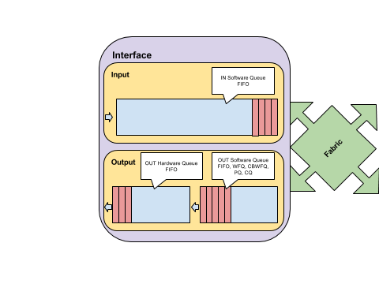

# Legacy Congestion Management

## Architecture



### Ingress

In the incoming direction,there is only one software queue that is always serviced using a FIFO algorithm. To only configuration available for the input queue is the size. You can specify it with:

```
R(config-if)# hold-queue IN-SIZE in
!Default:75
```

To see information about the hold-queue, use:

```
R# show interface INTERFACE | i Input queue
Input queue: 0/75/0/0 (size/max/drops/flushes); Total output drops: 0
```

You can enable [Selective Packet Discard](https://nyquist.eu/spd-selective-packet-discard/) to have more control over the Ingress Queue.

### Egress

When a device needs to send packets out an interface, it sends them to the Hardware Queue, also known as the TX Ring. The Hardware Queue is always serviced using FIFO. The size of the outgoing Hardware Queue can be configured using:

```
R(config-if)# tx-ring-limit HQ-SIZE
```

To see the size of the hardware queue, use:

```
R# show controllers INTERFACE | i tx_limited
tx_limited=0(128)
! In this example, 128 is the HQ-SIZE
```

When the Hardware Queue is full, the packets are queued in the Outgoing Software Queue. The size of this queue can also be configured using:

```
R(config-if)# hold-queue OUT-SIZE out
```

This queue is serviced by default using FIFO (high speed interfaces) or WFQ (Serial interfaces with bandwidth lower than E1 – 2048kbps).\
However, the outgoing software Queue can be configured to use one of the available queueing algorithims: FIFO, Fair Queuing (WFQ or CBWFQ), Priority Queueing (PQ) or Custom Queuing (CQ).\
To see information about the hold-queue, use:

```
R# show interface INTERFACE | i Output queue
! The display differs, according to the algorithm used
```

## Legacy Queuing algorithms

### FIFO

By default, all interfaces, except serial interfaces at E1(2048 kbps) or lower speeds, use the FIFO queuing. This means that packets are only served in the order of their arrival. A single queue is used for FIFO.

On serial interfaces with lower speeds (<2048 kbps), the default queuing mechanism used is Fair Queuing, but if you want, you can disable it and use FIFO instead:

```
R(config-if)# no fair-queue
```

To verify that FIFO is the queueing algorithm of an interface, use one of the following commands:

```
R# show interface INTERFACE | i Queue
Queueing strategy: fifo
R# show queuing interface INTERFACE
! For FIFO it will say:
Interface FastEthernet0/0 queueing strategy: none
R# show queue INTERFACE
! For FIFO it will say:
'Show queue' not supported with FIFO queueing.
```

### Weighted Fair Queuing

The main disadvantage of FIFO is that there is no difference between important traffic and less important traffic, so applications that need a certain level of QoS will not get it. Also, smaller flows, may end up being delayed or dropped altogether because the high bandwidth consumers are using all the available bandwidth.

Fair Queuing is a technique that offers a chance for the smallest flows to send traffic. At each time interval, the available bandwidth is split among all flows, based on the minimum request. That is the smallest flow will get the required bandwidth to send all traffic, and the other flows will get the same amount. The remaining bandwidth will be split again, also based on the minimum request, but this time there will be less flows.\
Cisco implements Fair Queuing with the possibility to prioritize traffic according to their importance. You can use fair queueing on an interface (called Flow-Based WFQ) or in a class-map inside a policy (called Class-Based WFQ).

#### **Flow-Based WFQ**

Flow-Based Weighted Fair Queuing is the default queuing mechanism used on slow speed (<2048 kbps) serial interfaces.\
A flow is identified as all the packets that share the same source and destination IP, source and destination TCP port and the same IP ToS Byte. The weight for a flow is calculated using the formula:

$$
W_{flow}= \frac{32384}{IPPrecedence + 1}
$$

In each time unit, a number of bytes inversely proportional to the weight or directly proportional to IP\_Precedence+1 is sent for each flow.\
Let’s define the following variables:

```
Bi = the bandwidth assigned to a flow with IP Precedence i.
Ni = the number of flows with IP Precedence i
B = available bandwidth
```

The next two equations are true:

$$
BW = \sum_{i=0..7}N_iB_i
$$

$$
BW = k\sum_{i=0..7}(i+1)N_i = k(1N_0 +2N_1+3N_2+4N_3+5N_4+6N_5+7N_6+8N_7)
$$

If you know the values for each Ni, then you know how much of the bandwidth will be assigned to a flow with a certain priority:

$$
B_i = \frac{B*(i+1)}{\sum_{i=0..7}(i+1)N_i}
$$

To enable flow-based WFQ if not already on, use:

```
R(config-if)# fair-queue [CDT [CONVERSATIONS [RSVP-QUEUES]
! CDT = Congestive Discard Threshold. Default:64
! CONVERSATIONS = number of Queues used - default: 256
! RSVP-QUEUES = number of queues available for RSVP Reservation - default:0
```

WFQ assigns a hash value to each flow. Based on this hash, a flow is assigned to a CONVERSATION. Different flows can be assigned to the same Conversation.

WFQ also uses a flavor of [RED](https://nyquist.eu/qos-101-congestion-avoidance/#2\_Random\_Early\_Detection\_RED) to drop packets when the Congestive Discard Threshold (CDT) is reached. It will drop packets from the flow with the highest scheduled time calculated as

$$
Time_{scheduled} = Size * Weight + Time_{previous}
$$

For a new flow, the previous Time is considered as the scheduled time of the last packet sent, therefor new flows are penalised just as old flows.

In addition to the queues assigned for each conversation (Queue ID: 1->CONVERSATIONS), there are 8 Link Queues which are reserved for network control and routing packets (Queue ID:CONVERSATIONS+1->CONVERSATIONS+8). The weight assigned for these queues is 1024 – which is lower than the lowest weight for normal traffic (32384/8 = 4048).

Then, if RTP Priority is used, it will use a Queue ID of CONVERSATIONS+9. This queue will have a weight of 0 and will act like a Priority Queue.

In the end, Queues for the RSVP flows are assigned and they will have a weight of 128.

To verify WFQ configuration, use:

```
R#show interface INTERFACE | b Input queue
  Queueing strategy: weighted fair
  Output queue: 0/1000/64/0 (size/max total/threshold/drops)
     Conversations  0/1/256 (active/max active/max total)
     Reserved Conversations 0/0 (allocated/max allocated)
     Available Bandwidth 1158 kilobits/sec
! The result is the same as:
R# show queueing interface INTEFACE
! and
R# show queue INTERFACE
```

The fallowing command displays information about all interfaces configured for fair-queueing:

```
R# show queueuing fair
Current fair queue configuration:

  Interface           Discard    Dynamic  Reserved  Link    Priority
                      threshold  queues   queues    queues  queues
  Serial1/0           64         256      0         8       1
  Serial1/1           64         256      0         8       1
```

### Custom Queuing (CQ)

CQ allows the use of up to 16 queues, with an assigned byte count. CQ cycles through each queue in a round-robin manner and allows each queue to send packets until the assigned byte count is exceeded. There is a default system queue (Queue 0) that cannot be configured, which will contain packets used for L2 keepalives. All other traffic, including routing updates are assigned to Queue 1 by default.

CQ uses a Deficit Round Robin algorithm, meaning that each time interval, a queue is allowed to send traffic until it exceeds the assigned Byte Count. If the Byte Count is exceeded, the packets are sent anyway, but the execess will be deducted from the Byte Count in the next round. The Byte Count also accounts for the L2 overhead.\
Let’s define for each queue:

```
BCq = Byte Count for Queue q
PSq = Average Packet Size for Queue q
TSq = Traffic Share for Queue q
```

$$
BC_q = k_q * PS_q
$$

$$
\frac{BC_{q1}}{BC_{q2}} = \frac{TS_{q1}}{TS_{q2}} = \frac{k_{q1}PS_{q1}}{k_{q2}PS_{q2}}
$$

We can then chose a convenient value for one of the k factors and find the Byte Count for each Queue so that our traffic is shared accordingly.

We can define different configurations for CQ on each interface. All configurations applied to an interface are grouped under a Queue-list. To configure CQ, first set up the queue length and byte count for each queue, using:

```
R(config)# queue-list CQ-LIST queue Q-ID limit LENGTH
R(config)# queue-list CQ-LIST queue Q-ID byte-count BYTES
```

We will then classify packets and assign them to each queue. The packets can be assigned by interface or by protocol:

```
R(config)# queue-list CQ-LIST protocol PROTOCOL Q-ID [PROTOCOL-OPTIONS]
R(config)# queue-list CQ-LIST interface INTERFACE Q-ID 
```

A default Queue can be assigned for unmatched traffic:

```
R(config)# queue-list CQ-LIST default Q-ID
! Default: Q-ID=1
```

By default, Queue 0 is used as a Priority Queue. You can set more queues to be served as priority queues, using:

```
R(config)# queue-list CQ-LIST lowest-custom Q-ID
!Default: Q-ID=1
```

This command actually defines what is the lowest Queue that is served in a round-robin fashion. Queues from 0 to the LowestCustomQueue-1 are considered Priority Queues, and the others are considered Custom Queues. As you can see, by default only Queue 0 is a Priority Queue.

In the end, apply CQ-LIST configuration on the interface:

```
R(config-if)# custom-queue-list CQ-LIST
```

You can verify configuration with:\
To verify the configuration, use:

```
R1#show interface INTERFACE | b Queueing
  Queueing strategy: custom-list 1
  Output queues: (queue #: size/max/drops)
     0: 0/20/0 1: 0/30/0 2: 0/20/0 3: 0/20/0 4: 0/20/0
     5: 0/20/0 6: 0/20/0 7: 0/20/0 8: 0/20/0 9: 0/20/0
     10: 0/20/0 11: 0/20/0 12: 0/20/0 13: 0/20/0 14: 0/20/0
     15: 0/20/0 16: 0/20/0
```

To see the configured CQ-LISTS, use:

```
R#show queueing custom
Current custom queue configuration:
List   Queue  Args
1      2      default
1      2      interface Serial1/0
1      2      protocol ip
1      1      limit 30
1      2      byte-count 128
```

### Priorty Queueing (PQ)

Priorty Queuing is a Queuing mechanism wich uses 4 queues knwon as HIGH, MEDIUM, NORMAL and LOW. They are serviced in the order of their priority, with a higher priority queue being always served before a lower priority queue.\
As in CQ, the configuration that is applied on an interface is grouped in a LIST.

Each queue has a defined length and when it is full, packets are dropped. The length of each queue can be set using:

```
R(config)# priority-list PQ-LIST queue-limit HIGH-LEN [MEDIUM-LEN [NORMAL-LEN [LOW-LEN]]]
!defaults: HIGH = 20, MEDIUM = 40, NORMAL: 60, LOW: 80
```

As with CQ, packets are assigned to a queue based on a classification process:

```
R(config)# priority-list PQ-LIST protocol PROTOCOL {high|medium|normal|low} [PROTOCOL-OPTIONS]
R(config)# priority-list PQ-LIST interface INTERFACE {high|medium|normal|low}
```

By default, all unclassified packets are assigned to the NORMAL queue, but this can be changed with:

```
R(config)# priority-list PQ-LIST default {high|medium|normal|low}
```

In the end, apply the PQ-LIST configuration on the interface:

```
R(config-if)# priority-group PQ-LIST
```

To verify, use:

```
R# show interface INTERFACE | b Queue
  Queueing strategy: priority-list 2
  Output queue (queue priority: size/max/drops):
     high: 0/10/0, medium: 0/20/0, normal: 0/30/0, low: 0/40/0
```

To see the existing CQ-LISTS:

```
R# show queueing priority
Current DLCI priority queue configuration:
Current priority queue configuration:

List   Queue  Args
2      low    default
2      high   limit 10
2      medium limit 20
2      normal limit 30
2      low    limit 40
```
