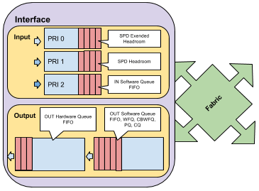

# SPD – Selective Packet Discard

SPD is a feature that allows prioritisation of the Input Queue. Normally, the Input Queue only allows FIFO scheduling. With SPD enabled, 2 additional queues are created, the SPD Headroom and the SPD Extended Headroom



Layer 2 keepalives and IGP packets are allowed to be enqueued in any of the 3 queues in the following order: Extended Headroom, Headroom, Input Queue.\
Other packets with IP Precedence 6, like BGP are allowed to be enqueed, in this order, only in the Headroom and the Input Queue.\
All other packets are only allowed in the Input Queue.\
When they are serviced, the Extended Headroom takes Priority over the Headroom and over the Input Queue

To enable SPD, use:

```
R(config)# spd enable
```

SPD can run in normal mode or in aggressive mode. In Aggressive mode, the packets considered malformed (packets that will generate ICMP messages) are dropped before they reach the processor. To enable aggressive mode, use:

```
R(config)# spd mode aggressive
```

The size of both headroom queues can be configure, using:

```
R(config)# spd headroom HR-SIZE
R(config)# spd ext-headroom EXT-HR-SIZE
```

A form of RED runs in the both the Headroom Queues. To configure the thresholds for RED, use:

```
R(config)# ip spd queue max-threshold MAX-TH
R(config)# ip spd queue min-threshold MIN-TH
! or, using one command:
R(config)# ip spd queue threshold min MIN-TH max MAX-TH
```

To verify SPD, use:

```
R# show ip spd
```
