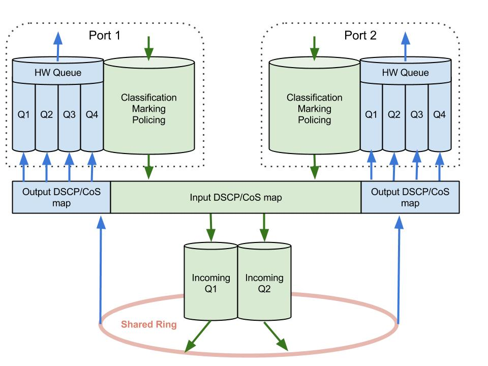

# Switching QoS

The following considerations are based on the Cisco 3560 platform.

## Enabling QoS

By default, QoS is disabled on a switch. You can enable it with:

```
Sw(config)# mls qos
```

Once QoS is enabled, all incoming packets are assigned a QoS label for internal processing. This QoS label is used for Classification and is actually a DSCP value. The QoS label can be derived from the incoming QoS marking or it can be overridden when the packet enters the switch. Based on this classification (QoS label), the packet will be treated throughout the switching process and when it is sent out, it will be marked with the DSCP value of QoS label.

### QoS Label

A QoS marking can reside at Layer 2 or at Layer 3. Basic Ethernet Frames don’t have a field in the header for a QoS marking, but such a field can be found in the 802.1q or ISL header. This field is a 3-bit field called CoS – Class of Service (available classes: 0-7).\
In the IP header, there is a field called the ToS Byte (Type of Service) which had different interpretations over time. First, only the first 3 bits were used for a QoS marking – IP Precedence (Available values: 0-7), but then the first 6 bits were used for another QoS marking called DSCP – Differentiated Services Code Point (Available values: 0-63). For more info about IP Precedence and DSCP, see http://nyquist.eu/classification-and-marking/#2\_Marking.

While QoS is disabled, the switch doesn’t change the QoS markings of the packets, but once QoS is enabled, it will mark outgoing packets with the DSCP value of the internal QoS label. By default, this label is set to the port DSCP value, which is 0.\
So once QoS is enabled, without any other configuration changes, the packets are assigned a QoS label of 0, so when they are sent out they will be marked with a DSCP value of 0, regardless of the markings they previously had. The default QoS label can be changed by modifying the default CoS value of the port, by trusting the incoming QoS markings or by assigning QoS labels via MQC policies.

## Classification

On a Cisco 3750 switch, there are 3 ways that can be used to classify packets.

* **mls qos trust and map**. In this mode, a port can be configured to trust or override incoming QoS markings, and to apply QoS label based on predefined QoS maps: cos-to-dscp, ip-prec-to-dscp, dscp-mutation
* **port-based MQC**. In this mode, a port can use MQC policies to classify incoming frames
* **VLAN-based MQC**. In this mode, ports in a VLAN can share a single MQC policy to classify incoming frames

At one time, a port can use only one of the methods above to perform classification of incoming frames.

### Trust and Map

#### **Trust**

Usually, a packet is classified when it enters a QoS domain. From there on, its QoS classification can be changed or trusted. To enable trusting of QoS settings, use:

```
Sw(config-if)# mls qos trust {cos|dscp|ip-precedence}
! cos = Trusts CoS value
! dscp = Trusts DSCP value of the packet.
! ip-precedence = Trusts IP Precedence value of the packet
```

Since the CoS field can only be found on frames entering the switch on a trunk port (ISL or dot1q encapsulation), you can have several situations where incoming frames don’t have a Cos marking:

* frames entering the switch on access ports
* frames of the native VLAN entering on a 802.1q trunk
* data traffic received from an IP Phone (data traffic is sent by the phone untagged, while voice traffic is tagged with the voice VLAN)

All IP Traffic has a ToS field so DSCP/IP-Precedence markings exist even if they are set to all zeros, but non-IP traffic doesn’t have such markings.\
For all of the above situations,the switch uses the port-default CoS value as the incoming QoS Marking. This value is 0 unless you specifically configure it with:

```
Sw(config-if)# mls qos cos COS [override]
! Default COS: 0
```

If you use the **override** keyword, you can override the trust setting and force the switch to apply the port CoS value to all incoming packets.

You can verify the qos settings of a port with the command:

```
Sw# show mls qos INTERFACE
```

Statistics regarding the markings received on each port can be seen with:

```
Sw# show mls qos INTERFACE statistics
```

It would help to clear these statistics from time to time with:

```
Sw# clear mls qos INTERFACE statistics
```

#### **Mapping**

A packet that is coming on a trusted interface will get its QoS label based on its marking. The markings can be different (CoS, IP-Precedence, DSCP), but the QoS label assigned must be from the same space. This is achieved by mapping the incoming QoS marking to a DSCP value representing the local QoS label, using one of the following maps:

```
Sw(config)# mls qos map cos-dscp DSCP0...DSCP7
! maps CoS 0 to DSCP0, CoS 1 to DSCP1, ... CoS 7 to DSCP7
! Default DSCP  = COS * 8
Sw(config)# mls qos map ip-prec-dscp DSCP0...DSCP7
! maps IP Prec 0 to DSCP0, IP Prec 1 to DSCP1, ... IP Prec 7 to DSCP7
```

As a best practice, the Voice Traffic should be mapped with CoS 5 and DSCP EF (DSCP 46). With the default CoS to DSCP mappings CoS 5 traffic will be mapped to DSCP 40, so you should change the default settings with:

```
Sw(config)# mls qos map cos-dscp 0 8 16 24 32 46 48 56
```

The incoming DSCP values can also be mapped to new DSCP values, but this map is null by default. To change it, first define a DSCP mutation map:

```
Sw(config)# mls qos map dscp-mutation MAP-NAME DSCP0 [DSCP1...DSCP7] to NEW-DSCP
! maps DSCP0 - DSCP7 to the NEW-DSCP value
```

and then use it on an interface:

```
Sw(config-if)# mls qos trust dscp
Sw(config-if)# mls qos dscp-mutation MAP-NAME
```

There is also a DSCP to CoS map that can be used to mark outgoing traffic in QoS Policies:

```
Sw(config)# mls qos map dscp-cos DSCP0 [DSCP1...DSCP7] to COS
! maps several DSCP values to one COS value
```

To see the QoS maps, use:

```
Sw# show mls qos maps [cos-dscp|dscp-cos|ip-prec-dscp|dscp-mutation]
```

#### **Trust Boundary**

Some devices (Cisco Phone, IP Camera, Telepresence Devices) send traffic encapsulated with 802.1q and mark the traffic with different CoS values. For example, a Cisco Phone marks voice traffic with CoS 5 (DSCP EF) and data traffic with CoS 0. You can force the switch to only trust traffic that comes from a certain type of device identified via CDP, by using the following commands:

```
! Enable CDP if disabled:
Sw(config-if)# cdp enable
! Set the port to trust CoS/DSCP
Sw(config-if)# mls qos trust {cos|dscp}
!
Sw(config-if)# mls qos trust device {cisco-phone|ip-camera|cts}
```

If the device is not found, then the port-default CoS value is used. Additionally, you can instruct an IP Phone, via CDP, to trust or to overwrite the CoS markings of the frames it receives on its Data port, from a PC, thus moving the trust boundary on the IP Phone. To enable this, use:

```
Sw(config-if)# switchport priority extend [cos COS|trust]
! Default: cos 0
! trust = trusts the QoS markings of the received frames
```

### MQC-based port policy

See MQC Policies.

### MQC-based VLAN policy

See MQC Policies.

## Marking

The default behavior of a switch is that once mls qos is enabled it will send the packets marked with the DSCP value of the QoS label. However this can be changed if you enable DSCP Transparency feature:

### DSCP Transparency

You can disable the rewriting of QoS markings with the DSCP value of the QoS label and send a packet with the same marking as it was received, using:

```
Sw(config)# no mls qos rewrite ip dscp
```

### MQC-based marking

See [MQC policies](classification-and-marking.md).

## MQC Policies

### Classification

Define a Class Map:

```
Sw(config)# class-map [match-all|match-any] CLASS-NAME
! match-all = AND (default) | match-any = OR
Sw(config-cmap)# match access-group ACL
! ACL can be simple, extended or MAC ACL
Sw(config-cmap)# match ip dscp DSCP-LIST
Sw(config-cmap)# match ip precedence IP-PREC-LIST
! On VLAN-Based Policies, you can also enable the ports that the policy applies to:
Sw(config-cmap)#  match input-interface INTERFACE-LIST
```

### Marking

Setting new QoS marking or trusting existing ones can be configured in a policy map:

```
Sw(config)# policy-map POLICY-MAP-NAME
Sw(config-pmap)# class {CLASS-NAME|class-default}
! Set the policy to trust markings of the incoming packets matched by the class
Sw(config-pmap-c)# trust {cos|dscp|ip-precedence}
! Set new markings:
Sw(config-pmap-c)# set {dscp NEW-DSCP| ip-precendece NEW-IP-PREC}
```

Traffic not matched by any class goes into the class-default class, which by default, doesn’t trust QoS markings and uses a QoS label equal to 0.

### Policing

Policing can be configured inside a policy map:

```
Sw(config-pmap-c)# police RATE BURST [exceed-action {drop|policed-dscp-transmit}]
```

The default action for policing is to drop the traffic that is exceeding the configured RATE. As an option, you can transmit the packet, but mark it according to the policed-DSCP map that can be configured with:

```
Sw(config)# mls qos map policed-dscp DSCP0 [DSCP1...DSCP7] to NEW-DSCP
! maps DSCP0...DSCP7 to the NEW-DSCP value
```

You can apply a policing policy on a port or on a SVI (if using VLAN-based mode – see below), but in the last case, you have to use a two-level policy to make the policing work.

#### **Aggregate Policers**

An aggregate policer can be configured to share the same policing profile to multiple classes of traffic. First, you will have to define the policing profile:

```
Sw(config)# mls qos aggregate-policer AGG-POLICER-NAME RATE BURST exceed-action {drop|policed-dscp-transmit}
```

Then use it in a policy:

```
Sw(config-pmap-c)# police aggregate AGG-POLICER-NAME
```

### Applying QoS Policies

#### **Port-based**

By default, QoS policies can only be configured on each individual physical interface. To do this, simply apply the policy with:

```
Sw(config-if)# service-policy in PORT-POLICY
```

Assigning a QoS policy will remove all other QoS settings on the port except the default CoS value of the port.

#### **VLAN-based**

You can enable a port to work in the vlan-based mode, by changing the mls qos mode of operation on the port, with:

```
Sw(config-if)# mls qos vlan-based
```

Now, in order to apply QoS policies on such a port, you will have to configure the policy on the SVI interface:

```
Sw(config)# interface vlan VLAN-ID
Sw(config-if)# service-policy in VLAN-POLICY
```

The policy will be applied to all ports that are part of this VLAN and that work in the VLAN-based mode. To verify if VLAN-Based is enabled on an interface, use:

```
Sw# show mls qos interface [INTERFACE]
```

If you want to set a VLAN-Based QoS policy that will police traffic, you are required to use a 2-layer policy, like this:\
Individual policies for each port can be configure with a two-level policy.

```
! Configure the VLAN-CLASS:
Sw(config)# class-map VLAN-CLASS
Sw(config-cmap)# match ...
! Configure the PORT-CLASS:
Sw(config)# class-map PORT-CLASS
Sw(config-cmap)# match input-interface INTERFACE-LIST
!       Only this type of match is allowed in the nested PORT-CLASS
! Configure the PORT-POLICY:
Sw(config)# policy-map PORT-POLICY
Sw(config-pmap)# class PORT-CLASS
Sw(config-pmap-c)# ...
! Configure the VLAN-POLICY:
Sw(config)# policy-map VLAN-POLICY
Sw(config-pmap)# class VLAN-QOS-CLASS
Sw(config-pmap-c)# set ...
! Reference the Policing policy map:
Sw(config-pmap-c)# service-policy POLICE-POLICY
```

## Queuing and Weighted Tail Drop

Because the total bandwidth of all incoming ports is greater than the bandwidth of the internal ring, 2 ingress queues are placed after classification, marking and policing takes place and before the switch fabric. These 2 queues service all incoming ports.

Additionally, 4 egress queues exist for each outgoing interface and are placed after the switch fabric and before the packet is sent out



Both ingress and egress queues are serviced by the same algorithm – SRR (Shaped/Shared Round Robin). SRR can work in 2 modes

* **Shaped mode** (available for both Ingress and Egress Queues) – in Shaped mode, each Egress Queue is guaranteed a percentage of the available bandwidth and is rate-limited to that value.
* **Shared Mode** (available only for egress Queues)- in Shared mode, the queues share the remaining bandwidth.

Both incoming and outgoing queues use buffers to store packets. The number of the buffers assigned to each queue is configured. Normally, when the buffers are full, tail drop occurs. You can use Weighted Tail Drop to prevent a tail drop that would drop important traffic.\
With WTD, each queue has 3 thresholds – 2 configurable thresholds and 1 non-configurable (=100%). Traffic is assigned to a queue and to one of the queue’s thresholds based on CoS/DSCP. When threshold 1 is reached, other traffic that would be assigned to threshold 1 is dropped (we have no more space for such traffic in the queue). The same happens for threshold 2. Threshold 3 is always 100% so it generates a tail drop.

### Ingress Queues

After a packet is received, classified, marked and policed on the ingress direction, it will go in one of the ingress queues before entering the Shared Ring. All ports send their packets to these 2 incoming queues.

Traffic is assigned to the queues based on DSCP/CoS (trust settings on the incoming interface). The default maps used to assign traffic to one queue or the other can be seen with:

```
Sw#show mls qos maps cos-input-q
   Cos-inputq-threshold map:
              cos:  0   1   2   3   4   5   6   7
              ------------------------------------
  queue-threshold: 1-1 1-1 1-1 1-1 1-1 2-1 1-1 1-1
! x-y = Queue-Threshold
Sw#show mls qos maps dscp-input-q
   Dscp-inputq-threshold map:
     d1 :d2  0    1    2    3    4    5    6    7    8    9
     ------------------------------------------------------------
      0 :  01-01 01-01 01-01 01-01 01-01 01-01 01-01 01-01 01-01 01-01
      1 :  01-01 01-01 01-01 01-01 01-01 01-01 01-01 01-01 01-01 01-01
      2 :  01-01 01-01 01-01 01-01 01-01 01-01 01-01 01-01 01-01 01-01
      3 :  01-01 01-01 01-01 01-01 01-01 01-01 01-01 01-01 01-01 01-01
      4 :  02-01 02-01 02-01 02-01 02-01 02-01 02-01 02-01 01-01 01-01
      5 :  01-01 01-01 01-01 01-01 01-01 01-01 01-01 01-01 01-01 01-01
      6 :  01-01 01-01 01-01 01-01
! 0x-0y = Queue-Threshold
```

The default maps can be changed with:

```
Sw(config)# mls qos srr-queue input cos-map Q-ID COS-LIST
! Q-ID: 1-2
! COS-LIST: list of CoS values assigned to Queue Q-ID
Sw(config)# mls qos srr-queue input dscp-map Q-ID DSCP-LIST
! Q-ID: 1-2
! DSCP-LIST: list of DSCP values assigned to Queue Q-ID
```

Packets from each queue are placed on the Shared Ring using the Shared Round Robin algorithm. Both queues are serviced proportionally to the configured weights:

```
Sw(config)# mls qos srr-queue input bandwidth W-Q1 W-Q2
! W-Q1, W-Q2 = Weight for Queue 1/2
! The available bandwidth is share between Q1 and Q2 W-Q1:W-Q2
```

One of the queues can also be configured to be a priority queue. This way, it will be serviced first, but it will be limited to a percentage of the available bandwidth. The remaining bandwidth will be shared between the other queue and the remaining traffic of the priority queue. To configure one of the queues as priority queue, use:

```
Sw(config)# mls qos srr-queue input priority-queue Q-ID bandwidth PRI-BW
! PRI-BW = Percentage assigned to the Priority Queue. Max: 40
! Default: Q-ID = 2, PRI-BW=10
```

Both queues share the same buffer space. You can change default configuration using:

```
Sw(config)# mls qos srr-queue input buffers PERCENT-Q1 PERCENT-Q2
! Default: PERCENT-Q1=90, PERCENT-Q2=10
```

To prevent tail drop, you can configure Weighted Tail Drop on the incoming queues. See above for a description of how WTD works. To configure threshold levels for each queue, use:

```
Sw(config)# mls qos srr-queue input threshold Q-ID TH1 TH2
! Q-ID = 1-2
! TH1, TH2 are configured as percentage. Default:100
! TH3 is always 100%
```

Packets are assigned by default to Threshold 1. See the default maps above. You can change this using:

```
Sw(config)# mls qos srr-queue input dscp-map threshold TH-ID DSCP-LIST
! or
Sw(config)# mls qos srr-queue input cos-map threshold TH-ID COS-LIST
! TH-ID = 1-3
! you can assign in the same command both the Q-ID and the TH-ID
! By default, DSCP values 0-39 and 48-63 are mapped to Queue 1 and Threshold 1
! By default, DSCP values 40-47 are mapped to Queue 2 and Threshold 1
! By default, CoS values 0-4,6 and 7 are mapped to Queue 1 with Threshold 1
! By default, Cos value 5 is mapped to Queue 2 with Threshold 1
```

To see configuration of the input queues, use:

```
Sw#show mls qos input-queue
Queue     :       1       2
----------------------------------------------
buffers   :      90      10
bandwidth :       4       4
priority  :       0      10
threshold1:     100     100
threshold2:     100     100
! Default configuration
```

### Egress Queues

Each port supports 4 egress queues. These queues can be service by SRR in Shaped or Shared mode. Two sets of weights are defined, one for Shaped mode and one for Shared mode:

```
Sw(config-if)# srr-queue bandwidth shape W1 W2 W3 W4
!Default: 25 0 0 0
Sw(config-if)# srr-queue bandwidth share W1 W2 W3 W4
!Default: 25 25 25 25
! Wi = Weight for Queue i
```

Queues that have a non-zero Shape Weight, work in Shaped mode, while the others work in Shared Mode.\
First, queues that work in Shape mode will be reserved and rate-limited to a bandwidth equal to:

$$
BW = \frac{1}{Weight}*Speed
$$

\
Where SPEED is the interface speed (10/100/1000). Therefore, the sum of all Shaped Weights cannot be more than 100.\
All shared queues will share the remaining bandwidth proportionally to the Shared Weights. The Weights for the Shaped Queues are ignored in this calculation. The Shared Weights cannot be set to zero.

Queue 1 can be configured as a priority queue and will be served before any other queue. It is not rate-limited so it can produce queue starvation. When Queue 1 is configured as a priority queue, its Weight is ignored when calculating the bandwidth assigned in Shaped and Shared mode for the other queues.

You can rate-limit the entire output of a port with:

```
Sw(config-if)# srr-queue bandwidth limit PERCENTAGE
! Default: 100, Configurable 10-90
```

Each physical port has a number of buffers that can be assigned to the outgoing queues. Additionally, threshold are configured for WTD. But you cannot set completely different configurations on each port. Instead, you can only use one of the 2 global templates, called Queue Sets.\
To configure the buffer allocation for a Queue Set, use:

```
Sw(config)# mls qos queue-set output Q-SET buffers P1 P2 P3 P4
! Pi = Percentage of the total numer of buffers that is allocated to Qi
! P1+P2+P3+P4=100
```

Next, we should configure the thresholds for WTD, with:

```
Sw(config)# mls qos queue-set output Q-SET threshold Q-ID TH-1 TH-2 RESERVED MAX
! TH-3 = 100
```

Out of the available buffers you have assigned a percentage P for each outgoing Queue. From these Buffers (P\*BUFF), only a part will be used by the Queue (RESERVED\*P\*BUFF). The remaining Buffers (BUFF-RESERVED\*P\*BUFF), will be allocated to a shared pool of Buffers. When queueing packets, when the RESERVED Threshold is reached, the queue will start using Buffers from the Shared Pool. How much it can use, depends on the MAX value. This value is the Maximum size that the queue can have before traffic will be tail dropped. TH1 and TH2 are the threshold values used by WTD.\
The defaults are:

```
R# show mls qos queue-set Q-SET
Queueset 1
Queue     :       1       2       3       4
-------------------------------------------
buffers   :      25      25      25      25
threshold1:     100     200     100     100
threhsold2:     100     200     100     100
reserved  :      50     100      50     100
maximum   :     400     400     400     400
```

To apply the template on the outgoing interface, use:

```
Sw(config-if)# queue-set QUEUE-SET
!QUEUE-SET: 1-2
```

The last step si to assign traffic to the outgoing Queues and to each Threshold:

```
Sw(config)# mls qos srr-queue output dscp-map queue Q-ID [threshold TH-ID] DSCP_LIST
! Default DSCP map:
! Q1 TH1: 40-47
! Q2 TH1: 0-15
! Q3 TH1: 16-31
! Q4 TH1: 32-39, 48-63
Sw(config)# mls qos srr-queue output cos-map queue Q-ID [threshold TH-ID] COS-LIST
! Q1 TH1: 5
! Q2 TH1: 0,1
! Q3 TH1: 2,3
! Q4 TH1: 4,6,7
```

## Auto QoS

Auto QoS is a feature that automatically generates QoS configuration in your switch. To enable autoqos use the following command on an port:

```
Sw(config-if)# auto qos voip {cisco-phone|cisco-softphone|trust}
! cisco-phone = trusts QoS markings from the phone
! cisco-softphone = trusts QoS markings from softphoine features
! trust - trusts incoming QoS markings
```

When the command is run for the first time, it enables **mls qos** and configures QoS maps and Queueing profiles. To see the commands used by auto qos, use:

```
Sw# show auto qos
```
