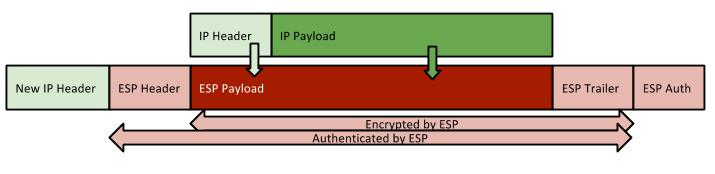
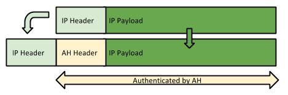
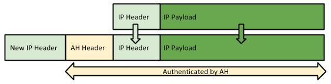
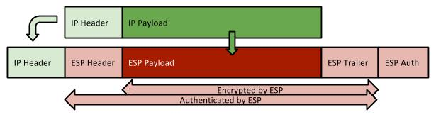
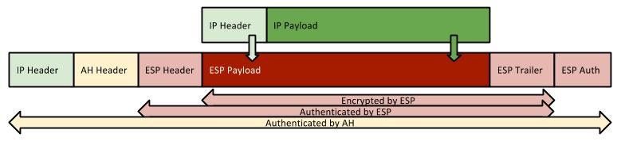

# IPSec VPN 101

IPSec is a framework of open standars that offers security services to IP communication. When using IPSec you get the following benefits:

* Data confidentiality – packets are encrypted before being sent
* Data integrity – the receiver can verify if a packet was altered between the sender and itself
* Data origin authentication – the receiver can authenticate the sender
* Anti replay – the receiver will detect and reject replayed packets

### Authentication and Encryption Protocols

#### **ESP (Encapsulating Security Payload)**

ESP (protocol number 50) is the protocol that offers encryption and authentication. In “transport mode”, ESP only takes the IP payload and encrypts it, leaving the IP Header untouched. This means that the source and destination address are kept end-to-end

.jpg>)

In “tunnel mode”, ESP takes both the IP Header and IP payload and encrypts it. It will have to build a new IP header to allow the traffic to reach the other end of the IPSec connection



**1.1.2 AH (Authentication Header)**

AH (protocol number 51) is used only for authentication of the information inside the IP Header. It works in “transport mode”, where it adds the AH between the IP Header and the IP Data



or in “tunnel mode”, where it adds a new IP Header and the AH Header before the initial IP Header and IP Data



#### **ESP & AH**

ESP and AH can be used simultaneously. In “transport mode” AH offers authentication to the IP Header and ESP offers encryption and authentication to the IP Data



In “tunnel mode”, there is an overlap of functionality since ESP can also offers authentication to the IP Heade



Choosing one method over another is subject to specific requirements, but usually comes down to the processing power of each peer.

### Security Associations (SAs)

An SA is a collection of parameters used to secure the communication between 2 peers. It specifies the protocols and algorithms to be used as well as the keying material.\
IPSec can use manual keys, but in most situations it uses a protocol to negotiate and exchange these keys. For this purpose, IPSec uses a scheme known as ISAKMP (Internet Security Association and Key Management Protocol) to mange the SAs and the keys. The IKE protocol implements the IPSEC scheme, so the 2 names might overlap.

## ISAKMP

The ISAKMP framework is a collection of methods used to manage the establishment of SAs and the keys involved in the process. IKE is a protocol that implements the ISAKMP framework.\
ISAKMP requires and IKE implements a 2 phase process for establishing an IPSec SA. In the 1st phase, an ISAKMP SA is established. The ISAKMP SA is then used to protect the negotiations for the IPSec SA in the 2nd phase.\
When implementing ISAKMP Phase 1, IKE can use either Main Mode or Aggressive Mode. When implementing ISAKMP Phase 2, IKE uses Quick Mode.

1. ISAKMP Phase 1
   * **IKE Main Mode**: Uses a minimum of 6 messages before the SA is established. Also provides identity protection.
   * **IKE Aggressive Mode**: Uses a minimum of 3 messages before the SA is established. Does not provide identity protection.
2. ISAKMP Phase 2
   * **IKE Quick Mode**: Similar to IKE Aggressive Mode, but protected by the ISAKMP SA negotiated in Phase 1

## Configuring IPSec

### Define a transform-set

A transform-set contains a list of possible transformations that are used in the IKE negotiation for the IPSec SA (IKE phase 2).

```
R(config)# crypto ipsec transform-set TRANSFORM-SET [AH-TR] [ESP-ENC-TR] [ESP-AUTH-TR] [COMPRESS-TR]
! AH-TR: ah-md5-hmac, ah-sha-hmac
! ESP-ENC-TR: esp-3des, esp-aes, esp-des, , esp-null, esp-seal,
! ESP-AUTH-TR: esp-sha-hmac, esp-md5-hmac
! COMPRESS-TR: comp-lzs
```

Once you define the transform-set, you can also specify the mode: tunnel mode or trasport mode

```
R(cfg-crypto-trans)# mode {tunnel|transport}
!Changes the mode associated with the transform set.
```

The mode setting is applicable only to the traffic whose source and destination addresses are the IPsec peer addresses. All other traffic is in tunnel mode only.

### Define Crypto Maps

#### **Static Maps: IKE vs manual**

When you create a crypto map, you have 2 options: either use manual keying, or IKE. To create a crypto map, use:

```
R(config)# crypto map CRYPTO-MAP SEQ {ipsec-isakmp|ipsec-manual}
! ipsec-isakmp uses IKE, ipsec-manual uses manual keys
R(config-crypto-map)# match address ACL
! Use the ACL to match the interesting traffic
R(config-crypto-map)# set peer PEER-IP
R(config-crypto-map)# set transform-set TRANSFORM-SET
```

When using IKE, you can also configure these settings:\
Other setting specific to isakmp crypto maps, are:

```
R(config-crypto-map)# set security-association lifetime {seconds SEC| kilobytes KB}
! Time/Quantity of data after which new keys are generated
R(config-crypto-map)# set security-association idle-time SEC
! When no packets are sent/received for idle-time, the SA is deleted.
R(config-crypto-map)# set security-association level per-host
! By default, all traffic for a peer uses the same SA.
! When using this command, packets for each host/destination pair will use a different SA
R(config-crypto-map)# set security-association replay {window-size SIZE|disable}
! You can customize or disable the anti-replay feature of IPSec.
R(config-crypto-map)# set pfs [group1|group2|group5]
! By default PFS is not requested. If requested, with no param, group1 is used.
```

When using manual keying, you have to specify the keys with:

```
! For ESP:
R(config-crypto-map)# set session-key {inbound|outbound} esp SPI cipher HEX-KEY [authenticator HEX-AUTHENTICATOR]
! For AH:
R(config-crypto-map)# set session-key {inbound|outbound} ah SPI HEX-KEY
```

Of course, the inbound key on one side must match the outbound key on the other side

#### **Dynamic maps**

A third option is to use dynamic maps. Dynamic maps act as templates that do not have all the information configured, but rather the missing data will be negotiated with the other peer. This implies that dynamic maps require the use of IKE. A dynamic map will never be used to start a negotiation. It will only be used to reply to other peers’requests.\
First you need to define the dynamic crypto map template with:

```
R(config)#crypto dynamic-map DYNAMIC-CRYPTO-MAP SEQ
R(config-crypto-map)#...
```

Then, reference the template in a static crypto map with:

```
R(config)# crypto map CRYPTO-MAP 10 ipsec-isakmp dynamic DYNAMIC-CRYPTO-MAP [discover]
! discover - enables Tunnel Endpoint Discovery
```

#### **Additional crypto map settings**

```
R(config-crypto-map)#qos pre-classify
! Enables qos classification before the packet is encrypted
R(config-crypto-map)#set ip access-group ACL
! Enables ACL filtering of the traffic before encryption. The interface access-group won't work on encrypted packets
```

RRI (Reverse Route Injection) is a feature that allows one peer to add static routes for the subnets on the other peer. By default, routes are added only if packets for the specified destination actually flow through the router.

```
R(config-crypto-map)# reverse-route {tag TAG|remote-peer [NEXT-HOP]} [static]
! no params: the route for the subnet will point to the interface where the crypto map is configured
! remote-peer - the route for the subnet will point to the peer address
!             - an additional route for the peer will point to the interface where the crypto map is configured
! remote-peer NEXT-HOP - the route for the subnet will point to the NEXT-HOP address
!                      - no additional route is added
! tag TAG - will add the routes with a TAG that can be used for filtering when redistributing
! static - creates the routes only based on ACL. There may be no active flows for that destination.
```

### Apply the Crypto Map

When sending traffic out an interface, the router will apply the IPSec configuration only if the outgoing interface has a crypto map configured, and that crypto map matches the outgoing packet to be sent. To configure an interface for IPSec, apply the crypto map with:

```
R(config-if)# crypto map CRYPTO-MAP
```

## Configuring ISAKMP phase 1

By default, a Cisco router uses Main Mode in Phase 1,except when pre-shared keys are used. This can be disabled with:

```
R(config)# crypto isakmp aggressive-mode disable
```

### Configuring ISAKMP policy

In ISAKMP phase 1, the router looks up the set of ISAKMP policies, in order of the SEQ.\
To define the ISAKMP policy, use the following commands:

```
R(config)# crypto isakmp policy SEQ
R(config-isakmp)# authentication {pre-share|rsa-sig|rsa-encr}
! Default: rsa-sig
R(config-isakmp)# encryption {des| 3des | aes {128|192|256}}
R(config-isakmp)# group {1|2|5}
! Sets the Diffie-Hellman group. Default: 1
R(config-isakmp)# hash {md5|sha}
! Default: SHA
R(config-isakmp)# lifetime SEC
! Default: 86400 (1 day)
```

### IKE Authentication

IKE authentication can be performed using pre-shared keys, PKI with digital certificates (X.509) or using RSA encrypted nonce. Depending on the authentication method you specified in the ISAKMP policy you will have to define one set of parameters or another.

#### **Pre-Shared Key**

Pre-shared keys are a simple way of authentication. To configure a pre-shared key, use:

```
R(config)# crypto isakmp key PSK {address PEER-IP [PEER-SUBNET]|hostname PEER-NAME} [no-xauth]
! no-xauth = Disbales extended authentication for router-to-router communication
```

#### **RSA encrypted nonces**

Follow these steps to generate RSA keys:\
First, set the hostname and domain:

```
R(config)# hostname HOSTNAME
R(config)# ip domain-name DOMAIN
```

```
R(config)# crypto key generate rsa usage-keys [modulus SIZE]
```

Verify the key exists with:

```
R# show crypto key mypubkey rsa
```

Now, you need to configure the public key-chain, with the public keys of the other peers:

```
R(config)# crypto key pubkey-chain rsa
Select the key based on either the name or the peer address:
R(config-pubkey-chain)# {addressed-key|named-key} PEER-IP [encryption|signature]
R(config-pubkey-key)# address ADDRESS
R(config-pubkey-key)# key-string
R(config-pubkey)# ...
! Enter the key of the PEER in HEX
R(config-pubkey)# quit
```

#### **PKI with digital certificates (X.509)**

This will be discussed in a later topic

### Additional ISAKMP configuration

To completely disable IKE, use:

```
R(config)# no crypto isakmp enable
```

You will have to manually specify all IPSEC SA information in the crypto maps.\
By default, each peer is identified by the IP address of the interface where the crypto map is applied. You can change this to either the hostname (used when the interface IP is not knwon – DHCP, or when multiple interfaces are used for IKE.) or to the DN (distinguished name – used for certificate-based authentication)

```
R(config)# crypto isakmp identity {address|hostname|dn}
! Default: address
```

To enable the recovery from “Invalid SPI” erros, use:

```
R(config)# crypto isakmp invalid-spi-recovery
! Default: disabled
```

To enable Dead Peer Detection, use:

```
R(config)# crypto isakmp keepalive SEC [RETRY-SEC] [periodic|on-demand]
! periodic - messages are sent every SEC. If 1 message is missed, the router sends messages every RETRY-SEC.
!     When 5 aggressive messages are missed, the peer is considered down.
! on-demand (default) - if no traffic is received from peer for SEC, then the retry process is started.
```

If IPSec is used with NAT, you can enable the router to send periodic keepalives just to keep the NAT translation active:

```
R(config)# crypto isakmp nat keepalive SEC
```
