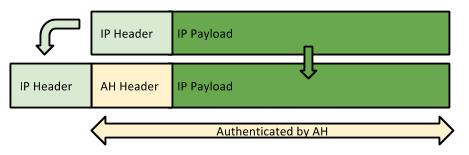
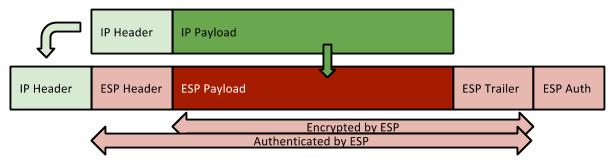

# IPSec VPN 101

IPSec is a framework of open standars that offers security services to IP communication. When using IPSec you get the following benefits:

* Data confidentiality – packets are encrypted before being sent
* Data integrity – the receiver can verify if a packet was altered between the sender and itself
* Data origin authentication – the receiver can authenticate the sender
* Anti replay – the receiver will detect and reject replayed packets

### Authentication and Encryption Protocols

#### **ESP (Encapsulating Security Payload)**

ESP (protocol number 50) is the protocol that offers encryption and authentication. In “transport mode”, ESP only takes the IP payload and encrypts it, leaving the IP Header untouched. This means that the source and destination address are kept end-to-end

.jpg>)

In “tunnel mode”, ESP takes both the IP Header and IP payload and encrypts it. It will have to build a new IP header to allow the traffic to reach the other end of the IPSec connection

**1.1.2 AH (Authentication Header)**

AH (protocol number 51) is used only for authentication of the information inside the IP Header. It works in “transport mode”, where it adds the AH between the IP Header and the IP Data

or in “tunnel mode”, where it adds a new IP Header and the AH Header before the initial IP Header and IP Data

#### **ESP & AH**

ESP and AH can be used simultaneously. In “transport mode” AH offers authentication to the IP Header and ESP offers encryption and authentication to the IP Data

In “tunnel mode”, there is an overlap of functionality since ESP can also offers authentication to the IP Heade

Choosing one method over another is subject to specific requirements, but usually comes down to the processing power of each peer.

### Security Associations (SAs)

An SA is a collection of parameters used to secure the communication between 2 peers. It specifies the protocols and algorithms to be used as well as the keying material.\
IPSec can use manual keys, but in most situations it uses a protocol to negotiate and exchange these keys. For this purpose, IPSec uses a scheme known as ISAKMP (Internet Security Association and Key Management Protocol) to mange the SAs and the keys. The IKE protocol implements the IPSEC scheme, so the 2 names might overlap.

## Configuring IPSEC

There are two ways to apply an IPSEC config. One is using [Crypto Maps](ipsec-crypto-maps-101.md). The other one is using [IPSEC Tunnels](ipsec-vti-101.md)
