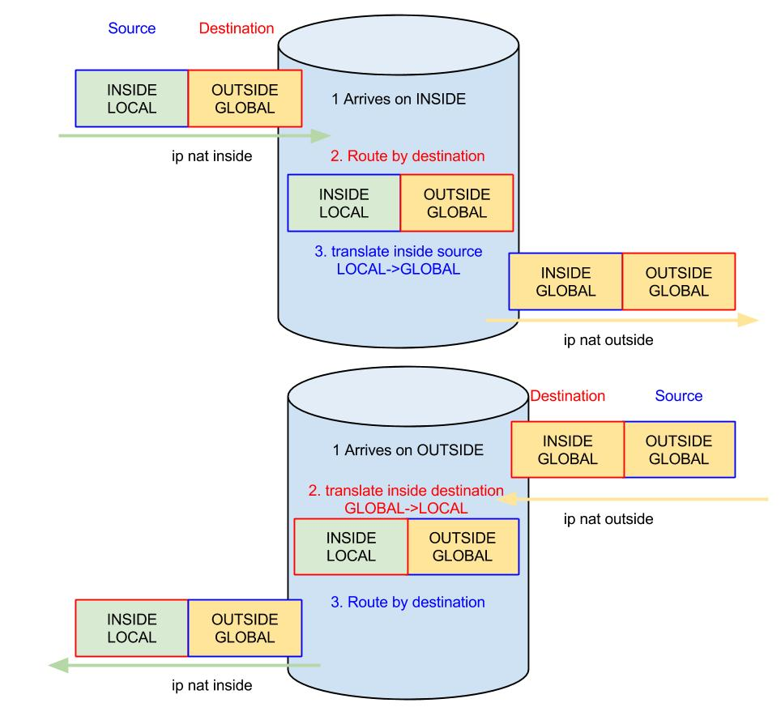
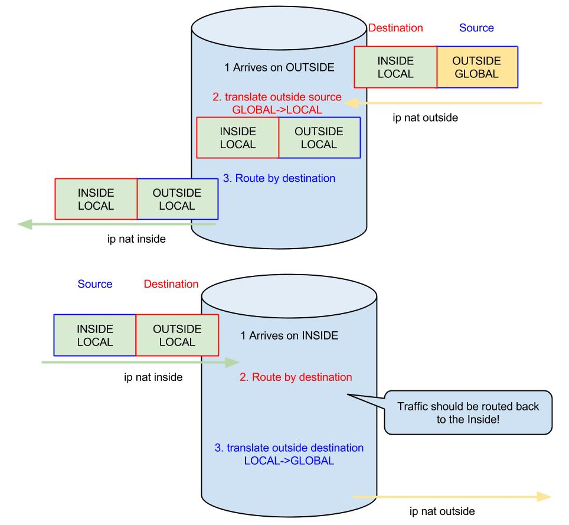

# NAT 101

## Inside, Outside, Local, Global

When defining NAT it is important to understand what Inside/Outside and Local/Global mean. When we use NAT, our router will be at the border between the Inside and the Outside zones. Hosts on the Inside are configured with addresses from the LOCAL Address Space and hosts on the Outside are configured with addresses from the GLOBAL Address Space. The router is the only device that is directly connected to both the Inside and the Outside.

* Hosts
  * **Inside** – hosts on the Inside
  * **Outside** – hosts on the Outside
* Addresses
  * **Local** – addresses used on the Inside (usually private addresses) - Locally Visible
  * **Global** – addresses used on the Outside (usually public addresses) - Globally Visible

## Types of NAT



Static NAT is the NAT operation where we have a 1:1 relationship between the Local IP and the Global IP. This is typically used when you want to allow outside hosts to initiate connections to inside hosts

The Static NAT makes a permanent entry in the NAT table that links the local address to the global address



**Dynamic NAT** is the NAT operation where we have many to many relationships between local IP addresses and global IP Addresses.&#x20;

Dynamic NAT entries may timeout from the NAT table so the same global address can later be associated with a different local address without any change of the config.

When you think about it, Dyamic NAT means that the local IP addresses will be associated with one global IP address at the time but once all global IP addresses available are consumed, a new host that wants to communcate with the outside will not be able to get a global IP assigned.

One form of Dynamic NAT is Dyanmic NAT with **Oveload** or **PAT** (Port Address Translation). In this case multiple local addresses can share one global IP Address (or sometimes a smaller pool of addresses). This is achieved by also translating the L4 information so that a unique association is formed between the local source and port and the global source and port.



## Classic NAT

### 1. Choose the sides: Inside and Outside

The basic idea with NAT is to change the Layer 3 address (either source or destination) of a packet. (You can change also the Layer 4 information, but this will come up later).

In most common scenarios you have 2 sides, called Inside and Outside and you will have to chose were your interfaces belong to.

```
R(config)# interface INSIDE-INTERFACE
R(config-if)# ip nat inside
R(config)# interface OUTSIDE-INTERFACE
R(config-if)# ip nat outside
```

In simple scnearios, you will have at least one interface on each side, but you can have multiple inside and outside interfaces. It all comes down to how the interface that is receiving the packet is configured for NAT which drives the order of operations:

1. When packets arrive on an **Inside** interface&#x20;
   1. they are **first routed** (based on destination IP address)&#x20;
   2. **then translation** occurs for either the source or the destination address.&#x20;
2. When packets arrive on the **Outside** interface,&#x20;
   1. they are f**irst translated** (either the source or the destination address)&#x20;
   2. **then** they are **routed** based on the destination address (which may have just been translated).

### 2. Create NAT bindings

This action is different depending on the type of NAT you will use but they are all configured from the global config mode:

```
R(config)# ip nat {inside|outside} ...
```

You will find more details about the options further down


### 3. Monitor NAT bindings

To monitor the bindings that the router knows about use the below command. It will show the Inside global, Inside local, Outside local and Outside global values in it's NAT table

```
R# show ip nat translations
R# show ip nat statistics
```

NAT translations that are not in use can be cleared from the NAT table with&#x20;

```
R# clear ip nat translation *
```

Of course, this doesn't apply to static entries which will appear in the NAT table even when there is no traffic.

## NAT Inside Source

When translating the Inside Source, we tell the router to translate the Source address of the packets that arrive on the Inside. So we first need to define an inside interface:

```
R(config)# interface INSIDE-INTERFACE
R(config-if)# ip nat inside
```

When the packet arrives, the router will first route it (based on the destination – OUTSIDE\_GLOBAL) and then it will translate the source IP. An entry is created into the NAT Translation table that maps the INSIDE\_LOCAL address to an INSIDE\_GLOBAL address.\
When the Outside Host replies, it sends return packets to the INSIDE\_GLOBAL destination address. If you want to get this traffic to the Inside Host, you have to make sure you receive it on an Outside interface

```
R(config)# interface OUTSIDE-INTERFACE
R(config-if)# ip nat outside
```

When the outside interface receives a packet, it will first translate it (based on the same entry into the NAT Translation table) and then it will route it (based on the new destination – INSIDE\_LOCAL



There are different options when implementing inside source NAT:

### Host Static NAT

Used to map one INSIDE\_LOCAL address to one INSIDE\_GLOBAL address:

```
R(config)# ip nat inside source static INSIDE_LOCAL INSIDE_GLOBAL
```

This command maps the INSIDE\_LOCAL address to the INSIDE\_GLOBAL address when performing source inside NAT. All IP packets sourced by the INSIDE\_LOCAL address get their source translated to the INSIDE\_GLOBAL, and all IP packets destined to the INSIDE\_GLOBAL address get their destination translated to INSIDE\_LOCAL.\
You can’t map the same INSIDE\_GLOBAL address to multiple INSIDE\_LOCAL addresses, or the other way around. Since this is a 1-to-1 mapping that is always present in the NAT table, connection can be initiated by any side (Inside and Outside).

### Port Static NAT

This configuration is similar with the one before, except that instead of translating all IP traffic, only traffic for 1 UDP or TCP port is translated. This allows the router to use the same INSIDE\_GLOBAL address for multiple INSIDE\_LOCAL addresses, as long as they use different GLOBAL\_PORTs

```
R(config)# ip nat inside source static {tcp|udp} INSIDE_LOCAL LOCAL_PORT INSIDE_GLOBAL GLOBAL_PORT
```

### Network Static NAT

Usually used when dealing with overlapping networks, this command allows translating the INSIDE\_LOCAL network to an INSIDE\_GLOBAL network. However, both networks have to have the same NETMASK.

```
R(config)# ip nat inside source static network INSIDE_LOCAL_NETWORK INSIDE_GLOBAL_NETWORK [/PREFIXLEN|NETMASK]
```

### Dynamic NAT

A dynamic map is used to enable translation for multiple hosts on the inside, and uses a many-to-many mapping, where multiple INSIDE\_LOCAL addresses are mapped to multiple INSIDE\_GLOBAL addresses.

For this, we must first define a pool of addresses to use as INSIDE\_GLOBAL and an ACL for the INSIDE\_LOCAL addresses:

```
R(config)# ip nat pool INSIDE_GLOBAL_POOL START-IP END-IP {netmask NETMASK|prefix-length LEN}
R(config)# access-list INSIDE_LOCAL_ACL permit INSIDE_LOCAL_ADDR [WILDCARD]
! It also works with an extended ACL
```

Then, enable Dynamic NAT with:

```
R(config)# ip nat inside source list INSIDE_LOCAL_ACL pool INSIDE_GLOBAL_POOL
```

Dynamic translations generate entries in the NAT table only when traffic comes on the Inside interface and is routed to the Outside Interface. This is when the router takes one address from the INSIDE\_GLOBAL\_POOL and maps it to the INSIDE\_LOCAL address that sourced the traffic. Traffic on the reverse path is dropped if there is no translation generated by traffic on the inside. If the translation times out, the INSIDE\_GLOBAL address is returned to the pool. But with enough active translations you can empty the INSIDE\_GLOBAL\_POOL, and conversations from new hosts on the INSIDE will not be allowed.

### Dynamic NAT with overload – PAT

When using Dynamic NAT without overload you could only have a small number of translations limited by the size of the INSIDE\_GLOBAL\_POOL. If the pool was empty, conversations from new hosts on the INSIDE were not allowed. With overloading, the source port is dynamically translated into a unique global port, so the router differentiate between inside hosts and uses fewer (even one) INSIDE\_GLOBAL addresses for many hosts on the inside.\
For this, we must again define a pool of addresses to use as INSIDE\_GLOBAL and an ACL for the INSIDE\_LOCAL addresses:

```
R(config)# ip nat pool INSIDE_GLOBAL_POOL INSIDE_GLOBAL_START INSIDE_GLOBAL_END {netmask NETMASK|prefix-lenght LEN}
R(config)# access-list INSIDE_LOCAL_ACL permit INSIDE_LOCAL_ADDR [WILDCARD]
! It also works with an extended ACL
```

Then, enable NAT with overloading:

```
R(config)# ip nat inside source list INSIDE_LOCAL_ACL pool INSIDE_GLOBAL_POOL overload
```

### NAT Outside Source

This type of NAT is used when you want the Outside Hosts to appear as Local Hosts. However, there are some problems to take care of so this setup is not that widely used.



With Outside Source NAT, when a packet sourced by OUTSIDE\_GLOBAL and destined to an INSIDE\_LOCAL address arrives on the Outside interface, it is first translated and then routed. This means that first we translate the source address (OUTSIDE\_GLOBAL to OUSIDE\_LOCAL) and then we should route based on the destination IP. The destination is the INSIDE\_LOCAL address so traffic should arrive to the Inside Host. However, return traffic will be packets sourced by the INSIDE\_LOCAL address and destined to the OUTSIDE\_LOCAL address. This is where things get tricky, because the destination is from the Local Address Space and we should send the packet back on the Inside interface. And this is exactly what happens unless we define a static route that forces the router to forward the packet on the Outside interface. You can see this by looking at the command **debug ip nat** and you will see that the traffic is returned to the incoming interface. One way to resolve this is by adding a more specific static route that points to the actual destination.\
Another way is to perform another Static NAT Translation for the return traffic. You will need a translation that takes the destination address\
You can make the router add the static route by itself if you use the **add-route** keyword but personally I have seen it fail, so a better way to do it is by using static routes.\
In some funky configuration you can even make another NAT Outside Source translation on the return path, which will result in have 2 outside interface defined and no inside interface.\
Now, based on the requirements, you may have to use both inside source and outside source translation, for example when dealing with [overlapping networks](https://nyquist.eu/nat-for-overlapping-networks/) and you may even have to use more static routes.\
As with inside NAT we have multiple ways of configuring the outside NAT

### Host Static NAT

```
R(config)# ip nat outside source static OUTSIDE_GLOBAL OUTSIDE_LOCAL
```

### Port Static NAT

```
R(config)# ip nat outside source static {tcp|udp} OUTSIDE_GLOBAL GLOBAL_PORT OUTSIDE_LOCAL LOCAL_PORT
```

### Network Static NAT

```
R(config)# ip nat outside source static network OUTSIDE_GLOBAL_NETWORK OUTSIDE_LOCAL_NETWORK {/PREFIXLEN|NETMASK}
```

### Dynamic NAT

```
R(config)# ip nat pool OUTSIDE_LOCAL_POOL START_IP END_IP {netmask NETMASK | prefix-length LEN}
```

```
R(config)# ip nat outside source list OUTSIDE_GLOBAL_ACL pool OUTSIDE_LOCAL_POOL 
```

## Inside Destination Address Translation – NAT for Server Load Balancing

Use it to redirect traffic for a SERVER-IP to a pool of real servers behind NAT. The process is somewhat similar to the Inside Source Address Translation, only this time traffic from Outside generates entries in the NAT table so the perspective changes:\
First define a pool that contains the INSIDE\_LOCAL servers, and an ACL that matches the OUTSIDE\_GLOBAL addresses of the server:

```
R(config)#ip nat pool REAL_SERVER_POOL START_IP END_IP {netmask NETMASK | prefix-length LEN} type rotary
R(config)# ip access-list GLOBAL_SERVER_ACL GLOBAL_ADDR [WILDCARD]
```

Then, enable the translation with:

```
R(config)# ip nat inside destination list GLOBAL_SERVER_ACL pool REAL_SERVER_POOL
```

The router will choose a new address from the REAL\_SERVER\_POOL, whenever a new Outside Host tries to access an IP from the GLOBAL\_SERVER\_ACL

## NAT Virtual Interface (NVI)

This feature removes the need to  define inside and outside interfaces. Instead you enable the interfaces for NVI and then the NAT order of operations changes such that routing operations happen twice:

1. Routing
2. NAT operation
3. Routing again with the new translated addresses

```
R(config)# access-list 1 permit 10.0.0.0 0.0.0.255
R(config)# ip nat source list 1 interface e0/1 overload
R(config)# int e0/0
R(config-if)# ip nat enable
R(config-if)#int e0/1
R(config-if)# ip nat enable 
```

What NVI helps with is allowing NATted trafic to flow between two inside interfaces.
