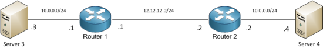

# NAT for Overlapping Networks

When we have 2 networks with overlapping addresses, chances are it’s not going to work. Unless, you use NAT.\
The situation we have to deal is can be seen in the next diagram



We have 2 routers, Router 1 and Router 2, connected via the 12.12.12.0/24 subnet. Each router has a LAN interface on the 10.0.0.0/24 subnet (the overlapping networks).\
How can we communicate between Server 3 and Server 4 without changing the addresses on each router? Let’s take it from the top.

The starting configurations are:

```
!Router 1:
R1(config)# int Fa0/1
R1(config-if)# ip address 10.0.0.1 255.255.255.0
R1(config-if)# int Fa0/0
R1(config-if)# ip address 12.12.12.1 255.255.255.0
!Router 2:
R2(config)# int Fa0/1
R2(config-if)# ip address 10.0.0.2 255.255.255.0
R2(config-if)# int Fa0/0
R2(config-if)# ip address 12.12.12.2 255.255.255.0
```

## Option 1 – NAT on both routers

Translate Server3’s IP address into 13.13.13.3 and Server4’s IP address int 24.24.24.4. Server 3 will use 24.24.24.4 to access Server 4, and Server 4 will use 13.13.13.3 to access Server 3. Each router will need to be aware of the inside global addresses used on the other router.

```
! On R1
R1(config-if)# int Fa0/1
R1(config-if)# ip nat inside
R1(config-if)# int Fa0/0
R1(config-if)# ip nat outside
R1(config-if)# exit
! Translate inside local 10.0.0.3 to inside global 13.13.13.3
R1(config)# ip nat inside source static 10.0.0.3 13.13.13.3
! Add a route towards the inside global subnet used on the other router:
R1(config)# ip route 24.24.24.0 255.255.255.0 12.12.12.2
!On R2
R2(config-if)# int Fa0/1
R2(config-if)# ip nat inside
R2(config-if)# int Fa0/0
R2(config-if)# ip nat outside
R2(config-if)# exit
! Translate inside local 10.0.0.4 to inside global 24.24.24.4
R1(config)# ip nat inside source static 10.0.0.4 24.24.24.4
! Add a route towards the inside global subnet used on the other router:
R1(config)# ip route 13.13.13..0 255.255.255.0 12.12.12.1
```

This was simple, but what if we have more than one IP addresses that must talk to each other? Adding static NAT entries for each host would not be much fun. The first option that comes to mind is to use dynamic NAT instead of the static NAT. Unfortunately, translations for inside source dynamic NAT are only created when the inside host initiates the traffic. We would have a situation, where most of the time the connection would not work, but some times it would. Can you guess when?\
The answer is when both hosts initiate a connection at about the same time (inside the timeout interval) and translation rules are created on both routers. Otherwise, the traffic would reach the router on the other end, but it would not know how to send it to the inside host.

Depending on the type of applications you can use Static NAT on one side and dynamic NAT on the other, but not both dynamic.

## Option 2 – NAT on one side only

Sometimes you do not have access to all devices in the network. Maybe R2 belongs to another company. We have to do it all in our R1 router. This can be done if we change both the source and the destination address in the packet:

```
R2(config)# int Fa0/0
R1(config-if)# ip nat outside
R1(config-if)# int Fa0/1
R1(config-if)# ip nat inside
R1(config-if)# exit
R1(config-if)# ip nat inside source static 10.0.0.3 13.13.13
R1(config-if)# ip nat outside source static 10.0.0.4 24.24.24.4
```

Again, depending on the side that initiates the connection you can use one static NAT and one dynamic NAT:

### Server 3 initiates

```
R(config)# ip nat inside source list 3 pool POOL3
R1(config)# ip nat outside source static 10.0.0.4 24.24.24.4
R1(config)# ip nat pool POOL3 13.13.13.1 13.13.254 prefix-length 24
R1(config)# access-list 3 permit 10.0.0.0 0.0.0.255
```

Server 3 will access Server 4 using 24.24.24.4 address

### Server 4 initiates

```
R1(config)# ip nat inside source static 10.0.0.3 13.13.13.3
R1(config)# ip nat outside source list 4 pool POOL4
R1(config)# ip nat pool POOL4 24.24.24.24.1 24.24.24.24.254 prefix-length 24
R1(config)# access-list 4 permit 10.0.0.0 0.0.0.255
```

Server 4 will access Server 3 using 13.13.13.3 address
